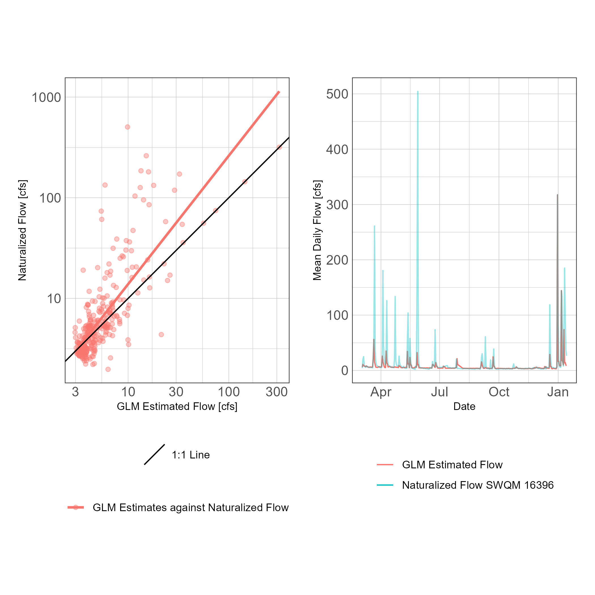

```r
##note, need development version of bookdown and gt to properly compile this document

## readr imports data
library(readr)
library(tidyr)
## tibbles are advanced fancy dataframes
library(tibble)
## dplyr for data handling and piping functions
library(dplyr)
## ggplot for plots
library(ggplot2)
## stringr to read and manipulate strings
library(stringr)
## here is a function to ensure file paths are correct
library(here)
## units and ggforce facilitate attaching units to data
library(units)
library(ggforce)
## hrbrtheme is optional, I use it to pretty my plots
library(hrbrthemes)
## patchwork and cowplot support arranging multiple ggplots into one plot
library(patchwork)
library(cowplot)
## lubridate provides functions for handling time and date
library(lubridate)
## purrr lets us use map_ functions as an alternative to loops
library(purrr)
## hydroGOF provide goodness of fit metrics (NSE, RMSE, etc.)
library(hydroGOF)
## tsibble and imputeTS will allow some simple time series interpolation
library(tsibble)
library(imputeTS)
## gt
library(gtsummary)
library(flextable)
## nls.multstart fits non-linear least squares using the Levenberg-Marquardt algorithm with multiple starting values.
library(nls.multstart)
##
library(mgcv)
library(gratia)
## apply drainage area ratio
library(dartx)

## set some options
update_geom_font_defaults(font_rc)
units_options(parse = FALSE)


## some custom functions
theme_ms <- function(...) {
  theme_ipsum_rc(plot_margin = margin(10,10,10,10),
              axis_title_just = "c") +
    theme(legend.position = "bottom",
          panel.background = element_rect(fill = "transparent", 
            colour = NA), 
          panel.border = element_rect(fill = NA, 
            colour = "grey20"),
          ...)
}

exponent <- function(x, pow) {
  (abs(x)^pow)*sign(x)
}
```

## About

This is an exploratory document investigating the feasibility of estimating mean daily streamflows in the Thompsons Creek watershed using empirical methods. In a previous document mean daily streamflows at three sites in the watershed were developed for March 2020 through March 20221 using measured flows, depths, and rating curves. The one-year record of streamflows will be used to fit and validate drainage area ratio, regression, and semi-parametric regression based methods for estimating streamflow using locally available data.

## Introduction


 


### Ungaged streamflow estimation

**Statistical information transfer methods**

Statistical information transfer and empirical regression are two relatively simple methods for estimating streamflows in poorly gaged watersheds using only measured stremaflow values from nearby gaged watersheds. Statistical transfer procedures simply transfer flow duration curves or daily streamflow values from a gaged watershed to the ungaged watershed using assumed relationships between area and runoff. The most common statistical transfer method is the drainage area ratio. With the drainage area ratio, daily streamflows are transferred from one basin to the other by multiplying the area ratio to daily streamflows:

\begin{equation}
Q_y^t = Q_x^t\bigg(\frac{A_y}{A_x}\bigg)^\phi
  (\#eq:dar)
\end{equation}

Where $Q_y^t$ is streamflow at ungaged basin $y$ and time $t$, $Q_x^t$ is streamflow at gaged basin $x$ and time $t$, and $\frac{A_y}{A_x}$ is the area ratio of the basins. Parameter $\phi$ is typically equal to one  [@asquith_statewide_2006]. However, @asquith_statewide_2006 provides empirically estimated values of $\phi$ for use in the drainage area ratio when applied in Texas. With an available short term streamflow record available, various stream gages can be assessed for performance using the drainage area ratio method. However, when that short-term streamflow record is available we extend the simple drainage area ratio to a linear regression for streamflow estimation using one or more gaged watersheds:

\begin{equation}
Q_y = \beta_0 + \beta_n{Q_{xn}} + \varepsilon
  (\#eq:linearregression1)
\end{equation}

where $Q_y$ is the predicted mean daily streamflow at the ungaged or temporarily gaged site, $\beta_0$ is the intercept, $Q_{xn}$ are mean daily streamflows at gaged watershed $n$, $\beta_n$ is the regression coefficient, and $varepsilon$ is the residual error term assumed normally distributed around mean zero. A linear regression of this form still acts as a streamflow transfer methods like the drainage area approach but allows for an easy incorporation of additional model terms such as lagged streamflows which might improve predictive performance.

**Semi-parametric rainfall-runoff regression**

If nearby gaged watersheds are unavailable or are not reflective of the streamflow responses in the ungaged watershed, locally available weather information can be used to empircally estimate streamflow response. A number of empirically based rainfall-runoff routing models are available that account for soil and land-use conditions to predict streamflow response (SIMHYD, IHACRES, and Sacramento rainfall-runoff models are examples). More complex mechanistic models that simulate hydrologic and water quality responses to landuse and precipitation are also available (SWAT and HSPF are two examples). The mechanistic models have a steep requirement for data and ability of the technician developing the model. The routing models and mechanistic models are outside the scope of work for this particular project. Here we focus on using a semi-parametric regression based approach to predict streamflow using locally available weather data. Empirical regression based approaches require a period of measured streamflow and some predictor variables to estimate the runoff response from. Typically, daily rainfall and temperature data are employed to fit a regression model to measured streamflow response:

\begin{equation}
Q_i = \beta_0 + \beta_1x_i+ \varepsilon_i
  (\#eq:linearregression2)
\end{equation}

where $Q$ is predicted discharge on day $i$, $\beta_0$ is the intercept, $\beta_1$ is the regression coefficient, $x$ is the predictor variable value on the $i$th day. The error term, $\varepsilon_i$ is assumed normally distributed around mean zero. Using simple linear or multiple linear regression $Q$ is typically log transformed prior to estimating the regression coefficients. Generalized linear models (GLMs) can instead be used when the data distribution is skewed (more specifically, when the residuals are not expected to be normally distributed). This is accomplished through the inclusion of a link function that describes how the mean of the response depends on the linear predictor and a variance function the describes how variance depends on the mean. Using the GLM and appropriate link function, transformation of the response variable can be avoided. This approach is highly desirable due to biases in the variance structure that are introduced when estimating the means of log transformed data that is intended to be back transformed to the original scale.

If the relationship between predictor variables and the response are expected to be nonlinear, polynomial terms can be included. However, an extension of GLMs called generalized additive models (GAMs) allows relatively easy fitting of these nonlinear terms to the data. With GAMs, the response variable depends on the sum of smoothing functions applied to each predictor variable:

\begin{equation}
Q_i = \beta_0 + f(x_1) + \varepsilon
  (\#eq:gam)
\end{equation}

where $Q$ is predicted discharge on day $i$, $\beta_0$ is the intercept, and some function $f(x_1)$ is the linear predictor. In the case of GAMs fit using the `mgcv` package in R, $f$ is a smoothing function fit to the data using generalized cross validation or restricted maximum likelihood. Due to the smoothing function and link functions, GAMs are extremely flexible for fitting regression models to data of different distributions and responses. However, compared to linear regression and GLMs the inclusion of the smoothing functions limits interpretability because traditional regression coefficients are not part of the model structure. Therefore, the effect of each individual smoothing function on the response variable mean is shown graphically.


## Method

### Data

Two National Oceanic and Atmospheric Administration (NOAA) Global Historical Climatology Network (GHCN) locations provide daily precipitation data for the project area (Figure \@ref(fig:precipsum); Figure \@ref(fig:temp)). GHCND daily summaries were downloaded for GHCND:USW00003904 (Easterwood Airport) using the NOAA API services and the `rnoaa` package in R [@chamberlain_2019].


```r
easterwood_precip <- read_csv("Data/noaa_precip/easterwood_precip.csv",
                               col_types = cols(
                                 date = col_datetime(format = ""),
                                 datatype = col_character(),
                                 station = col_character(),
                                 value = col_double(),
                                 fl_m = col_character(),
                                 fl_q = col_character(),
                                 fl_so = col_character(),
                                 fl_t = col_character(),
                                 units = col_character())) %>%
  mutate(value =  set_units(value/10, "mm")) %>%
  select(date, datatype, station, value)
  


easterwood_precip %>%
  mutate(date = as.Date(date),
         value = as.numeric(value)) %>%
  ggplot() +
  geom_line(aes(date, value)) +
  geom_point(aes(date, value), alpha = 0) +
  labs(y = "Daily precipitation (mm)",
       x = "Date") +
  facet_wrap(~station, ncol = 1) +
  theme_ms(plot.margin = margin(10,0,10,10),
           panel.spacing = unit(0, "lines"),
           panel.spacing.x = unit(0, "lines"),
           panel.spacing.y = unit(2, "lines")) -> p1

  

easterwood_precip %>%
  mutate(date = as.Date(date),
         value = as.numeric(value)) %>%
  ggplot() +
  geom_histogram(aes(value), binwidth = 5) +
  facet_wrap(~station, ncol = 1) +
  coord_flip() +
  theme_ms() +
  theme(axis.title.x = element_blank(),
        axis.title.y = element_blank(),
        axis.text.x = element_blank(),
        axis.text.y = element_blank(),
        panel.background = element_blank(),
        panel.border = element_blank(),
        panel.grid.major.x = element_blank(),
        panel.grid.minor.x = element_blank(),
        panel.grid.major.y = element_blank(),
        panel.grid.minor.y = element_blank(),
        plot.background = element_blank(),
        plot.margin = margin(10,10,10,0),
        panel.spacing = unit(0, "lines"),
        panel.spacing.x = unit(0, "lines"),
        panel.spacing.y = unit(2, "lines"),
        strip.text = element_text(color="transparent")) -> p2


plot_grid(p1,p2,align = "h", axis = "bt", rel_widths = c(2, 1))
```

<div class="figure">

<p class="caption">(\#fig:precipsum)Daily precipitation and marginal histograms of daily precipitation.</p>
</div>


```r
easterwood_tmax <- read_csv("Data/noaa_precip/easterwood_tmax.csv",
                               col_types = cols(
                                 date = col_datetime(format = ""),
                                 datatype = col_character(),
                                 station = col_character(),
                                 value = col_double(),
                                 fl_m = col_character(),
                                 fl_q = col_character(),
                                 fl_so = col_character(),
                                 fl_t = col_character(),
                                 units = col_character())) %>%
  mutate(value =  set_units(value/10, "°C")) %>%
  select(date, datatype, station, value)

easterwood_tavg <- read_csv("Data/noaa_precip/easterwood_tavg.csv",
                               col_types = cols(
                                 date = col_datetime(format = ""),
                                 datatype = col_character(),
                                 station = col_character(),
                                 value = col_double(),
                                 fl_m = col_character(),
                                 fl_q = col_character(),
                                 fl_so = col_character(),
                                 fl_t = col_character(),
                                 units = col_character())) %>%
  mutate(value =  set_units(value/10, "°C")) %>%
  select(date, datatype, station, value)

easterwood_tmax %>%
    mutate(date = as.Date(date),
         value = as.numeric(value)) %>%
  dplyr::rename(tmax = value) %>%
  left_join(easterwood_tavg %>% 
               mutate(date = as.Date(date),
                      value = as.numeric(value)) %>%
              dplyr::rename(tavg = value), by = c("date"="date")) -> easterwood_temps

easterwood_temps %>%
  pivot_longer(c(tmax, tavg), 
               names_to = "stat",
               values_to = "value") %>%
  ggplot() +
  geom_step(aes(date, value, color = stat), alpha = 0.5) +
  labs(y = "Daily Max Temperature [°C]",
       x = "Date") +
  theme_ms(plot.margin = margin(10,0,10,10),
           panel.spacing = unit(0, "lines"),
           panel.spacing.x = unit(0, "lines"),
           panel.spacing.y = unit(2, "lines")) -> p1

easterwood_temps %>%
  pivot_longer(c(tmax, tavg), 
               names_to = "stat",
               values_to = "value") %>%
  ggplot() +
  geom_density(aes(value,
                   fill = stat,
                   color = stat), 
                 binwidth = 1.1,
                 alpha = 0.5) +
  coord_flip() +
  theme_ms() +
  theme(axis.title.x = element_blank(),
        axis.title.y = element_blank(),
        axis.text.x = element_blank(),
        axis.text.y = element_blank(),
        panel.background = element_blank(),
        panel.border = element_blank(),
        panel.grid.major.x = element_blank(),
        panel.grid.minor.x = element_blank(),
        panel.grid.major.y = element_blank(),
        panel.grid.minor.y = element_blank(),
        plot.background = element_blank(),
        plot.margin = margin(10,10,10,0),
        panel.spacing = unit(0, "lines"),
        panel.spacing.x = unit(0, "lines"),
        panel.spacing.y = unit(2, "lines"),
        strip.text = element_text(color="transparent")) -> p2

plot_grid(p1,p2,align = "h", axis = "bt", rel_widths = c(2, 1))
```

<div class="figure">

<p class="caption">(\#fig:temp)Daily maximum temperature and marginal histograms of daily maximum temperature.</p>
</div>

We identified two wastewater treatment facilities located upstream of the lowest discharge point. The Still Creek WWTF (TPDES Permit No. WQ0010426002) is permitted to discharge 4.0 MGD to Still Creek and discharge flows past SWQM sites 16882 and 16396. The Sanderson Farm Inc. facility (TPDES Permit No. WQ0003821000) is permitted to discharge 1.678 MGD to a tributary of Cottonwood Branch and the discharge flows past SWQM site 16396. Mean daily wastewater facility discharges were downloaded from the EPA ECHO database (Figure \@ref(fig:wwtf)) using the `echor` R package and subtracted from the measured mean daily streamflows to better represent naturalized mean daily flows [@schramm_2020].


```r
wwtf <- read_csv("Data/EPA_WWTF/mean_daily_discharges.csv",
                 col_types = cols(
                   npdes_id = col_character(),
                   date = col_date(format = ""),
                   mgd = col_double(),
                   cfs = col_double()))
wwtf %>%
  ggplot() +
  geom_step(aes(date, cfs, color = npdes_id)) +
  scale_x_date(date_breaks = "month",
               date_labels = "%b-%y") +
  scale_color_discrete(labels = c("WQ0010426002, Still Creek WWTF",
                                "WQ0003821000, Sanderson Farm Inc." )) +
  labs(x = "Date", y = "Mean Daily Discharge [cfs]") + 
  theme_ms() +
  guides(x = guide_axis(angle = 90)) +
  theme(axis.line.x = element_blank(),
        axis.ticks.y = element_line(color = "black"),
        axis.ticks.x = element_line(color = "black"),
        axis.ticks.length = grid::unit(5, "pt"),
        legend.title = element_blank(),
        panel.grid.major.x = element_blank(),
        panel.grid.major.y = element_blank(),
        panel.grid.minor.x = element_blank(),
        panel.grid.minor.y = element_blank())
```

<div class="figure">

<p class="caption">(\#fig:wwtf)Mean daily WWTF discharges</p>
</div>


### Daily flow estimation

Mean daily streamflows from 2020-03-03 through 2021-01-14 were estimated using rating curves at SWQM stations 16396, 16397, and 16882 (Table \@ref(tab:dartable)). Mean daily wastewater discharges were subtracted from the flow record to represent naturalized flows. Mean daily temperature and total daily precipitation were joined to the data record by date. Figure \@ref(fig:meandailyresults) shows the hydrograph of naturalized flows and precipitation at each SWQM station.

Daily naturalized flow was estimated using the drainage area ratio equation (Equation \@ref(eq:dar)) at USGS stream gages 08065800, 08109800, and 08110100 (Table \@ref(tab:dartable)). Values of \phi recommended in @asquith_statewide_2006 were used. Linear regression was also used to estimate log transformed flows at each SWQM station using mean daily flows and 1-day lagged mean daily flows from each USGS stream gage as a predictor variable.


```r
dar_table <- tibble(Site = c("SWQM-16396", "SWQM-16397", "SWQM-16882", "USGS-08065800", "USGS-08109800", "USGS-08110100"),
       Description = c("Thompsons Creek at Silver Hill Rd",
                       "Thompsons Creek at Hwy 21",
                       "Still Creek at Hwy 21",
                       "Bedias Creek near Madisonville",
                       "East Yegua Creek near Dime Box",
                       "Davidson Creek near Lyons"),
       Area = c(42.33,24.21,10.03,321,244,195))

kable(dar_table,
      caption = "TCEQ SWQM stations and USGS stream gages used to develop flows with drainage area ratio and linear regression methods.")
```


Table: (\#tab:dartable)TCEQ SWQM stations and USGS stream gages used to develop flows with drainage area ratio and linear regression methods.

|Site          |Description                       |   Area|
|:-------------|:---------------------------------|------:|
|SWQM-16396    |Thompsons Creek at Silver Hill Rd |  42.33|
|SWQM-16397    |Thompsons Creek at Hwy 21         |  24.21|
|SWQM-16882    |Still Creek at Hwy 21             |  10.03|
|USGS-08065800 |Bedias Creek near Madisonville    | 321.00|
|USGS-08109800 |East Yegua Creek near Dime Box    | 244.00|
|USGS-08110100 |Davidson Creek near Lyons         | 195.00|


```r
##naturalize streamflows

df <- read_csv("Data/daily_streamflow/model_df.csv",
               col_types = cols(
                 Site = col_character(),
                 date = col_date(format = ""),
                 mean_daily = col_double()
                 ))


df %>%
  bind_rows(tibble(Site = c(rep("16396",5),rep("16397",5),rep("16882",5)),
                   date = rep(seq.Date(as.Date("2020-02-27"), as.Date("2020-03-02"), by = "day"),3),
                   mean_daily = NA)) %>%
  arrange(date) %>%
  left_join(easterwood_precip, by = c("date" = "date")) %>%
  mutate(value = as.numeric(value)) %>%
  dplyr::rename(ewood_precip = value) %>%
  left_join(easterwood_temps, by = c("date" = "date")) %>%
  dplyr::select(Site, date, mean_daily, ewood_precip, tmax, tavg) %>%
  left_join(wwtf %>% pivot_wider(id_cols = date, names_from = npdes_id, values_from = cfs),
            by = c("date" = "date")) %>%
  ## remove WWTF influence from discharge record
  mutate(adjusted_flow = case_when(
    Site == 16396 ~ mean_daily - TX0025071 - TX0113603, 
    Site == 16882 ~ mean_daily - TX0025071,
    Site == 16397 ~ mean_daily)) %>%
  mutate(adjusted_flow = case_when(
    adjusted_flow < 0 ~ 0,
    adjusted_flow >= 0 ~ adjusted_flow)) %>%
  mutate(doy = lubridate::yday(date))-> df
```


```r
## plot hydrograph of Thompsons @ Silver Hill
p1 <- ggplot(df %>% filter(Site == "16396") %>% mutate(date = as.Date(date))) + 
  geom_line(aes(date, adjusted_flow, color = "Mean Daily Streamflow")) +
  scale_y_continuous(position = "left", 
                  limits = c(0,600),
                  expand = c(0,0)) +
  scale_x_date(date_breaks = "month",
               date_labels = "%b-%y") +
  labs(y = "Mean daily streamflow [cfs]", 
       x = "Date",
       caption = "16396, Thompsons Creek at Silver Hill Rd") +
  scale_color_manual(values = c("dodgerblue")) +
  theme_ms() +
  guides(x = guide_axis(angle = 90)) +
  theme(axis.text.x = element_text(size = 8),
        axis.title.y.left = element_text(hjust = 0),
        axis.ticks.y.left = element_line(color = "black"),
        axis.ticks.x = element_line(color = "black"),
        axis.ticks.length = grid::unit(5, "pt"),
        panel.grid.major.x = element_blank(),
        panel.grid.major.y = element_blank(),
        panel.grid.minor.x = element_blank(),
        panel.grid.minor.y = element_blank(),
        legend.position = "none") 

p2 <- ggplot(df %>% filter(Site == "16396")) + 
  geom_line(aes(date, ewood_precip, color = "Total Daily Preciptitation")) +
  scale_y_reverse(position = "right", 
                  limits = c(350,0),
                  breaks = c(0,25,50),
                  labels = c(0,25,50),
                  expand = c(0,0)) +
  labs(y = "Total Daily Precipitaiton [mm]") +
  scale_color_manual(values = c("dodgerblue4")) +
  theme_ms() +
  guides(x = guide_axis(angle = 90)) +
  theme(axis.line.x = element_blank(),
    axis.text.x = element_blank(),
    axis.title.y.right = element_text(hjust = 1),
    axis.title.x = element_blank(),
    axis.ticks.y.right = element_line(color = "black"),
    axis.ticks.length = grid::unit(5, "pt"),
    panel.grid.major.x = element_blank(),
    panel.grid.major.y = element_blank(),
    panel.grid.minor.x = element_blank(),
    panel.grid.minor.y = element_blank(),
    legend.position = "none"
    ) 
set_null_device("agg")
aligned_plots <- align_plots(p1, p2, align="hv", axis="tblr")
set_null_device("agg")
hg_plot1 <- ggdraw(aligned_plots[[1]]) + draw_plot(aligned_plots[[2]])

## plot hydrograph of Thompsons @ Hwy21
p1 <- ggplot(df %>% filter(Site == "16397") %>% mutate(date = as.Date(date))) + 
  geom_line(aes(date, adjusted_flow, color = "Mean Daily Streamflow")) +
  scale_y_continuous(position = "left", 
                  limits = c(0,75),
                  expand = c(0,0)) +
  scale_x_date(date_breaks = "month",
               date_labels = "%b-%y") +
  labs(y = "Mean daily streamflow [cfs]", 
       x = "Date",
       caption = "16397, Thompsons Creek at Hwy 21") +
  scale_color_manual(values = c("dodgerblue")) +
  theme_ms() +
  guides(x = guide_axis(angle = 90)) +
  theme(axis.text.x = element_text(size = 8),
        axis.title.y.left = element_text(hjust = 0),
        axis.ticks.y.left = element_line(color = "black"),
        axis.ticks.x = element_line(color = "black"),
        axis.ticks.length = grid::unit(5, "pt"),
        panel.grid.major.x = element_blank(),
        panel.grid.major.y = element_blank(),
        panel.grid.minor.x = element_blank(),
        panel.grid.minor.y = element_blank(),
        legend.position = "none") 

p2 <- ggplot(df %>% filter(Site == "16397")) + 
  geom_line(aes(date, ewood_precip, color = "Total Daily Preciptitation")) +
  scale_y_reverse(position = "right", 
                  limits = c(350,0),
                  breaks = c(0,25,50),
                  labels = c(0,25,50),
                  expand = c(0,0)) +
  labs(y = "Total Daily Precipitaiton [mm]") +
  scale_color_manual(values = c("dodgerblue4")) +
  theme_ms() +
  guides(x = guide_axis(angle = 90)) +
  theme(axis.line.x = element_blank(),
    axis.text.x = element_blank(),
    axis.title.y.right = element_text(hjust = 1),
    axis.title.x = element_blank(),
    axis.ticks.y.right = element_line(color = "black"),
    axis.ticks.length = grid::unit(5, "pt"),
    panel.grid.major.x = element_blank(),
    panel.grid.major.y = element_blank(),
    panel.grid.minor.x = element_blank(),
    panel.grid.minor.y = element_blank(),
    legend.position = "none"
    ) 
set_null_device("agg")
aligned_plots <- align_plots(p1, p2, align="hv", axis="tblr")
set_null_device("agg")
hg_plot2 <- ggdraw(aligned_plots[[1]]) + draw_plot(aligned_plots[[2]])


## plot hydrograph of Sill Creek @ Hwy21
p1 <- ggplot(df %>% filter(Site == "16882") %>% mutate(date = as.Date(date))) + 
  geom_line(aes(date, adjusted_flow, color = "Mean Daily Streamflow")) +
  scale_y_continuous(position = "left", 
                  limits = c(0,75),
                  expand = c(0,0)) +
  scale_x_date(date_breaks = "month",
               date_labels = "%b-%y") +
  labs(y = "Mean daily streamflow [cfs]", 
       x = "Date",
       caption = "16882, Sill Creek at Hwy 21") +
  scale_color_manual(values = c("dodgerblue")) +
  theme_ms() +
  guides(x = guide_axis(angle = 90)) +
  theme(axis.text.x = element_text(size = 8),
        axis.title.y.left = element_text(hjust = 0),
        axis.ticks.y.left = element_line(color = "black"),
        axis.ticks.x = element_line(color = "black"),
        axis.ticks.length = grid::unit(5, "pt"),
        panel.grid.major.x = element_blank(),
        panel.grid.major.y = element_blank(),
        panel.grid.minor.x = element_blank(),
        panel.grid.minor.y = element_blank(),
        legend.position = "none") 

p2 <- ggplot(df %>% filter(Site == "16882")) + 
  geom_line(aes(date, ewood_precip, color = "Total Daily Preciptitation")) +
  scale_y_reverse(position = "right", 
                  limits = c(350,0),
                  breaks = c(0,25,50),
                  labels = c(0,25,50),
                  expand = c(0,0)) +
  labs(y = "Total Daily Precipitaiton [mm]") +
  scale_color_manual(values = c("dodgerblue4")) +
  theme_ms() +
  guides(x = guide_axis(angle = 90)) +
  theme(axis.line.x = element_blank(),
    axis.text.x = element_blank(),
    axis.title.y.right = element_text(hjust = 1),
    axis.title.x = element_blank(),
    axis.ticks.y.right = element_line(color = "black"),
    axis.ticks.length = grid::unit(5, "pt"),
    panel.grid.major.x = element_blank(),
    panel.grid.major.y = element_blank(),
    panel.grid.minor.x = element_blank(),
    panel.grid.minor.y = element_blank(),
    legend.position = "none"
    ) 
set_null_device("agg")
aligned_plots <- align_plots(p1, p2, align="hv", axis="tblr")
set_null_device("agg")
hg_plot3 <- ggdraw(aligned_plots[[1]]) + draw_plot(aligned_plots[[2]])


hg_plot1 / hg_plot2 / hg_plot3
```

<div class="figure">

<p class="caption">(\#fig:meandailyresults)Hydrograph of mean daily streamflows at SWQM 16396, 16397, and 16882 with reported total daily precipitation at Easterwood Airport.</p>
</div>

GLMs and GAMs relied on local precipitation and temperature data to estimate streamflows at each SWQM station (Figure \@ref(fig:precipsum); Figure \@ref(fig:temp)). The GLM was of form:

\begin{multline}
Q = P + T + DOY + P_{sum,3} + T_{mean,5} + (P\times T) + (P \times P_{sum,3}) + (P \times T_{mean,5}) + (T \times P_{sum,3})\\ + (T \times T_{mean,5}) + (P_{sum,3} \times T_{mean,5})
  (\#eq:glmstructure)
\end{multline}

where $P$ is total daily precipitation and $T$ is mean daily temperature, and are assumed to be the main forcing variables influencing streamflow. $DOY$ is day of the year and included as a seasonal predictor. $P_{sum,3}$ is the rolling 3-day sum rainfall and included as an indicator of wetness in the watershed. $T_{mean,5}$ is the rolling 5-day mean temperature and included as an indicator of seasonal temperature condition that is less daily variance than $T$ and maybe an improved indicator of potential evapotransportation conditions. The GLM error structure was fit with a scaled t distribution and a log link function.

The GAM included the same variables but with smoothing functions:

\begin{multline}
Q = f(P) + f(T) + f(DOY) + f(P_{sum,3}) + f(T_{mean,5})\\ + f(P,T) + f(P, P_{sum,3}) + f(P,T_{mean,5}) + f(T,P_{sum,3}) + (T,T_{mean,5}) + f(P_{sum,3},T_{mean,5})
  (\#eq:gamstructure)
\end{multline}

where $f()$ is the smoothing function. Where a single covariate is smoothed, a thin plate regression spline was fit to the data using restricted maximum likelihood to estimated the automatically select the optimal smoothing parameters. For smoothing functions applied to two parameters, a tensor product smooth function was applied. The GAM error structure was fit using the scaled t distribution and a log link function.

Performance of predicted streamflows over the period of record for each method was assessed using Nash-Sutcliffe Efficiency (NSE) and Kling-Gupta Efficiency (KGE) goodness-of-fit metrics. 

## Results


```r
## create a model df for 16396
## additional variable = 
## wetness index = 3 day total precip
## ET index = 5 day avg tmax


df %>%
  dplyr::filter(Site == "16396") %>%
  arrange(date) -> df_16396

df_16396 %>%
  mutate(wetness = map(row_number(.$date),
                    ~{if(.x - 1 <= 0) {df_16396$ewood_precip[.x]}
                      if(.x - 2 <= 0) {sum(df_16396$ewood_precip[.x],
                                           df_16396$ewood_precip[.x-1])}
                      if(.x - 2 > 0) {
                       sum(
                        df_16396$ewood_precip[.x],
                        df_16396$ewood_precip[.x-1],
                        df_16396$ewood_precip[.x-2],
                        na.rm = TRUE
                        ) 
                      }}),
         et = map(row_number(.$date),
                    ~{if(.x - 1 <= 0) {df_16396$tavg[.x]}
                      if(.x - 2 <= 0) {df_16396$tavg[.x-1]}
                      if(.x - 3 <= 0) { mean(c(df_16396$tavg[.x-1],
                                            df_16396$tavg[.x-2]),
                                            na.rm = TRUE)}
                      if(.x - 4 <= 0) { mean(c(df_16396$tavg[.x-1],
                                            df_16396$tavg[.x-2],
                                            df_16396$tavg[.x-3]),
                                            na.rm = TRUE)}
                      if(.x - 5 <= 0) { mean(c(df_16396$tavg[.x-1],
                                            df_16396$tavg[.x-2],
                                            df_16396$tavg[.x-3],
                                            df_16396$tavg[.x-4]),
                                            na.rm = TRUE)}
                      mean(c(df_16396$tavg[.x-1],
                        df_16396$tavg[.x-2],
                        df_16396$tavg[.x-3],
                        df_16396$tavg[.x-4],
                        df_16396$tavg[.x-5]),
                        na.rm = TRUE)})) %>%
  unnest(c(wetness, et)) %>%
  dplyr::filter(!is.na(mean_daily)) -> df_16396
```

### Statistical Information Transfer

**DAR**

Mean daily streamflows estimated using DAR applied to three different USGS streamgages are displayed in Figure \@ref[fig:dar16396results]. All three USGS gages results in biased results at low streamflows (consistently underpredicted streamflows). The hydrographs indicate the timing and magnitude of stormflow events are routinely mismatched using any of the three USGS gages. This visual validation suggests DAR method is not suitable in the Thompsons Creek watershed.


```r
## apply DAR to 16396 using each select USGS gage
usgs_08065800 <- readr::read_csv("Data/USGS_Streamflow/08065800.csv") %>%
  dplyr::rename(Flow_08065800 = "133946_00060_00003") %>%
  dplyr::select(datetime, Flow_08065800)

usgs_08109800 <- readr::read_csv("Data/USGS_Streamflow/08109800.csv") %>%
  dplyr::rename(Flow_08109800 = `135356_00060_00003`) %>%
  dplyr::select(datetime, Flow_08109800)

usgs_08110100 <- readr::read_csv("Data/USGS_Streamflow/08110100.csv") %>%
  dplyr::rename(Flow_08110100 = `135389_00060_00003`) %>%
  dplyr::select(datetime, Flow_08110100)


df_16396 %>%
  dplyr::select(Site, date, adjusted_flow) %>%
  left_join(usgs_08065800, by = c("date" = "datetime")) %>%
  dartx(Flow_08065800, 42.33/321) %>%
  dplyr::rename(DAR_Q_08065800 = Q,
                Q_percentile_08065800 = Q_percentile,
                exp_08065800 = exp) %>%
  left_join(usgs_08109800,  by = c("date" = "datetime")) %>%
  dartx(Flow_08109800, 42.33/244) %>%
  dplyr::rename(DAR_Q_08109800 = Q,
                Q_percentile_08109800 = Q_percentile,
                exp_08109800 = exp) %>%
  left_join(usgs_08110100,  by = c("date" = "datetime")) %>%
  dartx(Flow_08110100, 42.33/195) %>%
  dplyr::rename(DAR_Q_08110100 = Q,
                Q_percentile_08110100 = Q_percentile,
                exp_08110100 = exp) -> dar_results_16396
```


```r
dar_results_16396 %>%
  dplyr::select(Site, date, adjusted_flow, DAR_Q_08065800, DAR_Q_08109800, DAR_Q_08110100) %>%
  pivot_longer(c(DAR_Q_08065800, DAR_Q_08109800, DAR_Q_08110100),
               names_to = "Source_Site",
               values_to = "Estimated_Flow") %>%
  mutate(Source_Site = case_when(
    Source_Site == "DAR_Q_08065800" ~ "Estimated flow using USGS-08065800",
    Source_Site == "DAR_Q_08109800" ~ "Estimated flow using USGS-08109800",
    Source_Site == "DAR_Q_08110100" ~ "Estimated flow using USGS-08110100"
  )) %>%
  ggplot() +
  geom_point(aes(Estimated_Flow, adjusted_flow, color = "DAR Estimates against Naturalized Flow"), alpha = 0.3) +
  geom_smooth(aes(Estimated_Flow, adjusted_flow, color = "DAR Estimates against Naturalized Flow"), 
              method = "lm", se = FALSE, alpha = 0.3) +
  geom_abline(aes(linetype = "1:1 Line", intercept = 0, slope = 1)) +
  facet_wrap(~Source_Site, scales = "free", ncol = 1) +
  scale_x_continuous(trans = "pseudo_log") + scale_y_continuous(trans = "pseudo_log") +
  labs(x = "DAR Estimated Flow [cfs]", y = "Naturalized Flow [cfs]") +
  guides(color = guide_legend(""), linetype = guide_legend("")) +
  theme_ms() + 
  theme(legend.margin = margin(0,0,0,0),
        legend.box = "vertical",
        legend.box.margin = margin(0,0,0,0),
        legend.direction = "vertical") -> p1

dar_results_16396 %>%
  dplyr::select(Site, date, DAR_Q_08065800, DAR_Q_08109800, DAR_Q_08110100) %>%
  pivot_longer(c(DAR_Q_08065800, DAR_Q_08109800, DAR_Q_08110100),
               names_to = "Source_Site",
               values_to = "Estimated_Flow") %>%
  mutate(Source_Site = case_when(
    Source_Site == "DAR_Q_08065800" ~ "Estimated flow using USGS-08065800",
    Source_Site == "DAR_Q_08109800" ~ "Estimated flow using USGS-08109800",
    Source_Site == "DAR_Q_08110100" ~ "Estimated flow using USGS-08110100"
  )) %>%
  ggplot() +
  geom_line(aes(date, Estimated_Flow, color = "DAR Estimated Flow")) +
  geom_line(data = dar_results_16396, aes(date, adjusted_flow, color = "Naturalized Flow SWQM 16396"), alpha = 0.4) +
  facet_wrap(~Source_Site, scales = "free_y", ncol = 1) +
  labs(x = "Date", y = "Mean Daily Flow [cfs]") +
  theme_ms() + 
  theme(legend.title = element_blank(),
        legend.direction = "vertical") -> p2

p1 + p2
```

```
## `geom_smooth()` using formula 'y ~ x'
```

<div class="figure">

<p class="caption">(\#fig:dar16396results)Estimated streamflows at SWQM 16396 using DAR at three USGS gages plotted against measured streamflows and over time.</p>
</div>


**Linear Regression**


```r
df_16396 %>%
  dplyr::select(Site, date, adjusted_flow) %>%
  left_join(usgs_08065800, by = c("date" = "datetime")) %>%
  left_join(usgs_08109800,  by = c("date" = "datetime")) %>%
  left_join(usgs_08110100,  by = c("date" = "datetime")) %>%
  mutate(lag_Flow_08065800 = lag(Flow_08065800),
         lag_Flow_08109800 = lag(Flow_08109800),
         lag_Flow_08110100 = lag(Flow_08110100),
         log_Q = log1p(adjusted_flow)) -> df_16396_lm

m1.lm <- lm(log_Q ~ Flow_08065800 + 
              Flow_08109800 + 
              Flow_08110100 + 
              lag_Flow_08065800 + 
              lag_Flow_08109800 + 
              lag_Flow_08110100,
            data = df_16396_lm)


# tbl_regression(m1.lm,
#                intercept = TRUE,
#                estimate_fun = ~style_sigfig(.x, digits = 3),
#                label = list(Flow_08065800 ~ "Q at 08065800",
#                             Flow_08109800 ~ "Q at 08109800",
#                             Flow_08110100 ~ "Q at 08110100",
#                             lag_Flow_08065800 ~ "1 Day Lagged Q at 08065800",
#                             lag_Flow_08109800 ~ "1 Day Lagged Q at 08109800",
#                             lag_Flow_08110100 ~ "1 Day Lagged Q at 08110100")) %>%
#   modify_header(update =list(
#     label ~"**Variable**",
#     estimate ~ "**Coefficient**")) %>%
#   add_glance_source_note(include = c(r.squared, statistic, df)) %>%
#   modify_caption("Summary of linear regression model coefficients at SWQM 16396")

flextable::as_flextable(m1.lm) %>%
  set_caption("Summary of linear regression coefficients at SWQM 16396")
```

```{=html}
<template id="536238c7-0e0e-413a-83f3-d9553137c47a"><style>
.tabwid table{
  border-collapse:collapse;
  line-height:1;
  margin-left:auto;
  margin-right:auto;
  border-width: 0;
  display: table;
  margin-top: 1.275em;
  margin-bottom: 1.275em;
  border-spacing: 0;
  border-color: transparent;
}
.tabwid_left table{
  margin-left:0;
}
.tabwid_right table{
  margin-right:0;
}
.tabwid td {
    padding: 0;
}
.tabwid a {
  text-decoration: none;
}
.tabwid thead {
    background-color: transparent;
}
.tabwid tfoot {
    background-color: transparent;
}
.tabwid table tr {
background-color: transparent;
}
</style><div class="tabwid"><style>.cl-bd38b164{border-collapse:collapse;}.cl-bd204afc{font-family:'Arial';font-size:11pt;font-weight:normal;font-style:normal;text-decoration:none;color:rgba(0, 0, 0, 1.00);background-color:transparent;}.cl-bd204afd{font-family:'Arial';font-size:11pt;font-weight:normal;font-style:italic;text-decoration:none;color:rgba(0, 0, 0, 1.00);background-color:transparent;}.cl-bd210e24{margin:0;text-align:left;border-bottom: 0 solid rgba(0, 0, 0, 1.00);border-top: 0 solid rgba(0, 0, 0, 1.00);border-left: 0 solid rgba(0, 0, 0, 1.00);border-right: 0 solid rgba(0, 0, 0, 1.00);padding-bottom:5pt;padding-top:5pt;padding-left:5pt;padding-right:5pt;line-height: 1;background-color:transparent;}.cl-bd210e25{margin:0;text-align:right;border-bottom: 0 solid rgba(0, 0, 0, 1.00);border-top: 0 solid rgba(0, 0, 0, 1.00);border-left: 0 solid rgba(0, 0, 0, 1.00);border-right: 0 solid rgba(0, 0, 0, 1.00);padding-bottom:5pt;padding-top:5pt;padding-left:5pt;padding-right:5pt;line-height: 1;background-color:transparent;}.cl-bd22467c{width:33.4pt;background-color:transparent;vertical-align: middle;border-bottom: 0 solid rgba(0, 0, 0, 1.00);border-top: 0 solid rgba(0, 0, 0, 1.00);border-left: 0 solid rgba(0, 0, 0, 1.00);border-right: 0 solid rgba(0, 0, 0, 1.00);margin-bottom:0;margin-top:0;margin-left:0;margin-right:0;}.cl-bd22467d{width:54.2pt;background-color:transparent;vertical-align: middle;border-bottom: 0 solid rgba(0, 0, 0, 1.00);border-top: 0 solid rgba(0, 0, 0, 1.00);border-left: 0 solid rgba(0, 0, 0, 1.00);border-right: 0 solid rgba(0, 0, 0, 1.00);margin-bottom:0;margin-top:0;margin-left:0;margin-right:0;}.cl-bd22467e{width:92.7pt;background-color:transparent;vertical-align: middle;border-bottom: 0 solid rgba(0, 0, 0, 1.00);border-top: 0 solid rgba(0, 0, 0, 1.00);border-left: 0 solid rgba(0, 0, 0, 1.00);border-right: 0 solid rgba(0, 0, 0, 1.00);margin-bottom:0;margin-top:0;margin-left:0;margin-right:0;}.cl-bd22467f{width:63.3pt;background-color:transparent;vertical-align: middle;border-bottom: 0 solid rgba(0, 0, 0, 1.00);border-top: 0 solid rgba(0, 0, 0, 1.00);border-left: 0 solid rgba(0, 0, 0, 1.00);border-right: 0 solid rgba(0, 0, 0, 1.00);margin-bottom:0;margin-top:0;margin-left:0;margin-right:0;}.cl-bd224680{width:119.6pt;background-color:transparent;vertical-align: middle;border-bottom: 0 solid rgba(0, 0, 0, 1.00);border-top: 0 solid rgba(0, 0, 0, 1.00);border-left: 0 solid rgba(0, 0, 0, 1.00);border-right: 0 solid rgba(0, 0, 0, 1.00);margin-bottom:0;margin-top:0;margin-left:0;margin-right:0;}.cl-bd224681{width:63.3pt;background-color:transparent;vertical-align: middle;border-bottom: 0 solid rgba(0, 0, 0, 1.00);border-top: 0 solid rgba(0, 0, 0, 1.00);border-left: 0 solid rgba(0, 0, 0, 1.00);border-right: 0 solid rgba(0, 0, 0, 1.00);margin-bottom:0;margin-top:0;margin-left:0;margin-right:0;}.cl-bd224682{width:92.7pt;background-color:transparent;vertical-align: middle;border-bottom: 0 solid rgba(0, 0, 0, 1.00);border-top: 0 solid rgba(0, 0, 0, 1.00);border-left: 0 solid rgba(0, 0, 0, 1.00);border-right: 0 solid rgba(0, 0, 0, 1.00);margin-bottom:0;margin-top:0;margin-left:0;margin-right:0;}.cl-bd224683{width:54.2pt;background-color:transparent;vertical-align: middle;border-bottom: 0 solid rgba(0, 0, 0, 1.00);border-top: 0 solid rgba(0, 0, 0, 1.00);border-left: 0 solid rgba(0, 0, 0, 1.00);border-right: 0 solid rgba(0, 0, 0, 1.00);margin-bottom:0;margin-top:0;margin-left:0;margin-right:0;}.cl-bd224684{width:33.4pt;background-color:transparent;vertical-align: middle;border-bottom: 0 solid rgba(0, 0, 0, 1.00);border-top: 0 solid rgba(0, 0, 0, 1.00);border-left: 0 solid rgba(0, 0, 0, 1.00);border-right: 0 solid rgba(0, 0, 0, 1.00);margin-bottom:0;margin-top:0;margin-left:0;margin-right:0;}.cl-bd224685{width:119.6pt;background-color:transparent;vertical-align: middle;border-bottom: 0 solid rgba(0, 0, 0, 1.00);border-top: 0 solid rgba(0, 0, 0, 1.00);border-left: 0 solid rgba(0, 0, 0, 1.00);border-right: 0 solid rgba(0, 0, 0, 1.00);margin-bottom:0;margin-top:0;margin-left:0;margin-right:0;}.cl-bd224686{width:33.4pt;background-color:transparent;vertical-align: middle;border-bottom: 0 solid rgba(0, 0, 0, 1.00);border-top: 0 solid rgba(0, 0, 0, 1.00);border-left: 0 solid rgba(0, 0, 0, 1.00);border-right: 0 solid rgba(0, 0, 0, 1.00);margin-bottom:0;margin-top:0;margin-left:0;margin-right:0;}.cl-bd226d82{width:54.2pt;background-color:transparent;vertical-align: middle;border-bottom: 0 solid rgba(0, 0, 0, 1.00);border-top: 0 solid rgba(0, 0, 0, 1.00);border-left: 0 solid rgba(0, 0, 0, 1.00);border-right: 0 solid rgba(0, 0, 0, 1.00);margin-bottom:0;margin-top:0;margin-left:0;margin-right:0;}.cl-bd226d83{width:92.7pt;background-color:transparent;vertical-align: middle;border-bottom: 0 solid rgba(0, 0, 0, 1.00);border-top: 0 solid rgba(0, 0, 0, 1.00);border-left: 0 solid rgba(0, 0, 0, 1.00);border-right: 0 solid rgba(0, 0, 0, 1.00);margin-bottom:0;margin-top:0;margin-left:0;margin-right:0;}.cl-bd226d84{width:63.3pt;background-color:transparent;vertical-align: middle;border-bottom: 0 solid rgba(0, 0, 0, 1.00);border-top: 0 solid rgba(0, 0, 0, 1.00);border-left: 0 solid rgba(0, 0, 0, 1.00);border-right: 0 solid rgba(0, 0, 0, 1.00);margin-bottom:0;margin-top:0;margin-left:0;margin-right:0;}.cl-bd226d85{width:119.6pt;background-color:transparent;vertical-align: middle;border-bottom: 0 solid rgba(0, 0, 0, 1.00);border-top: 0 solid rgba(0, 0, 0, 1.00);border-left: 0 solid rgba(0, 0, 0, 1.00);border-right: 0 solid rgba(0, 0, 0, 1.00);margin-bottom:0;margin-top:0;margin-left:0;margin-right:0;}.cl-bd226d86{width:33.4pt;background-color:transparent;vertical-align: middle;border-bottom: 2pt solid rgba(102, 102, 102, 1.00);border-top: 0 solid rgba(0, 0, 0, 1.00);border-left: 0 solid rgba(0, 0, 0, 1.00);border-right: 0 solid rgba(0, 0, 0, 1.00);margin-bottom:0;margin-top:0;margin-left:0;margin-right:0;}.cl-bd226d87{width:54.2pt;background-color:transparent;vertical-align: middle;border-bottom: 2pt solid rgba(102, 102, 102, 1.00);border-top: 0 solid rgba(0, 0, 0, 1.00);border-left: 0 solid rgba(0, 0, 0, 1.00);border-right: 0 solid rgba(0, 0, 0, 1.00);margin-bottom:0;margin-top:0;margin-left:0;margin-right:0;}.cl-bd226d88{width:119.6pt;background-color:transparent;vertical-align: middle;border-bottom: 2pt solid rgba(102, 102, 102, 1.00);border-top: 0 solid rgba(0, 0, 0, 1.00);border-left: 0 solid rgba(0, 0, 0, 1.00);border-right: 0 solid rgba(0, 0, 0, 1.00);margin-bottom:0;margin-top:0;margin-left:0;margin-right:0;}.cl-bd226d89{width:92.7pt;background-color:transparent;vertical-align: middle;border-bottom: 2pt solid rgba(102, 102, 102, 1.00);border-top: 0 solid rgba(0, 0, 0, 1.00);border-left: 0 solid rgba(0, 0, 0, 1.00);border-right: 0 solid rgba(0, 0, 0, 1.00);margin-bottom:0;margin-top:0;margin-left:0;margin-right:0;}.cl-bd226d8a{width:63.3pt;background-color:transparent;vertical-align: middle;border-bottom: 2pt solid rgba(102, 102, 102, 1.00);border-top: 0 solid rgba(0, 0, 0, 1.00);border-left: 0 solid rgba(0, 0, 0, 1.00);border-right: 0 solid rgba(0, 0, 0, 1.00);margin-bottom:0;margin-top:0;margin-left:0;margin-right:0;}.cl-bd226d8b{width:92.7pt;background-color:transparent;vertical-align: middle;border-bottom: 0 solid rgba(255, 255, 255, 0.00);border-top: 0 solid rgba(255, 255, 255, 0.00);border-left: 0 solid rgba(255, 255, 255, 0.00);border-right: 0 solid rgba(255, 255, 255, 0.00);margin-bottom:0;margin-top:0;margin-left:0;margin-right:0;}.cl-bd226d8c{width:54.2pt;background-color:transparent;vertical-align: middle;border-bottom: 0 solid rgba(255, 255, 255, 0.00);border-top: 0 solid rgba(255, 255, 255, 0.00);border-left: 0 solid rgba(255, 255, 255, 0.00);border-right: 0 solid rgba(255, 255, 255, 0.00);margin-bottom:0;margin-top:0;margin-left:0;margin-right:0;}.cl-bd229492{width:33.4pt;background-color:transparent;vertical-align: middle;border-bottom: 0 solid rgba(255, 255, 255, 0.00);border-top: 0 solid rgba(255, 255, 255, 0.00);border-left: 0 solid rgba(255, 255, 255, 0.00);border-right: 0 solid rgba(255, 255, 255, 0.00);margin-bottom:0;margin-top:0;margin-left:0;margin-right:0;}.cl-bd229493{width:63.3pt;background-color:transparent;vertical-align: middle;border-bottom: 0 solid rgba(255, 255, 255, 0.00);border-top: 0 solid rgba(255, 255, 255, 0.00);border-left: 0 solid rgba(255, 255, 255, 0.00);border-right: 0 solid rgba(255, 255, 255, 0.00);margin-bottom:0;margin-top:0;margin-left:0;margin-right:0;}.cl-bd229494{width:119.6pt;background-color:transparent;vertical-align: middle;border-bottom: 0 solid rgba(255, 255, 255, 0.00);border-top: 0 solid rgba(255, 255, 255, 0.00);border-left: 0 solid rgba(255, 255, 255, 0.00);border-right: 0 solid rgba(255, 255, 255, 0.00);margin-bottom:0;margin-top:0;margin-left:0;margin-right:0;}.cl-bd229495{width:33.4pt;background-color:transparent;vertical-align: middle;border-bottom: 0 solid rgba(255, 255, 255, 0.00);border-top: 0 solid rgba(255, 255, 255, 0.00);border-left: 0 solid rgba(255, 255, 255, 0.00);border-right: 0 solid rgba(255, 255, 255, 0.00);margin-bottom:0;margin-top:0;margin-left:0;margin-right:0;}.cl-bd229496{width:54.2pt;background-color:transparent;vertical-align: middle;border-bottom: 0 solid rgba(255, 255, 255, 0.00);border-top: 0 solid rgba(255, 255, 255, 0.00);border-left: 0 solid rgba(255, 255, 255, 0.00);border-right: 0 solid rgba(255, 255, 255, 0.00);margin-bottom:0;margin-top:0;margin-left:0;margin-right:0;}.cl-bd229497{width:119.6pt;background-color:transparent;vertical-align: middle;border-bottom: 0 solid rgba(255, 255, 255, 0.00);border-top: 0 solid rgba(255, 255, 255, 0.00);border-left: 0 solid rgba(255, 255, 255, 0.00);border-right: 0 solid rgba(255, 255, 255, 0.00);margin-bottom:0;margin-top:0;margin-left:0;margin-right:0;}.cl-bd229498{width:63.3pt;background-color:transparent;vertical-align: middle;border-bottom: 0 solid rgba(255, 255, 255, 0.00);border-top: 0 solid rgba(255, 255, 255, 0.00);border-left: 0 solid rgba(255, 255, 255, 0.00);border-right: 0 solid rgba(255, 255, 255, 0.00);margin-bottom:0;margin-top:0;margin-left:0;margin-right:0;}.cl-bd229499{width:92.7pt;background-color:transparent;vertical-align: middle;border-bottom: 0 solid rgba(255, 255, 255, 0.00);border-top: 0 solid rgba(255, 255, 255, 0.00);border-left: 0 solid rgba(255, 255, 255, 0.00);border-right: 0 solid rgba(255, 255, 255, 0.00);margin-bottom:0;margin-top:0;margin-left:0;margin-right:0;}.cl-bd22949a{width:33.4pt;background-color:transparent;vertical-align: middle;border-bottom: 2pt solid rgba(102, 102, 102, 1.00);border-top: 2pt solid rgba(102, 102, 102, 1.00);border-left: 0 solid rgba(0, 0, 0, 1.00);border-right: 0 solid rgba(0, 0, 0, 1.00);margin-bottom:0;margin-top:0;margin-left:0;margin-right:0;}.cl-bd22949b{width:63.3pt;background-color:transparent;vertical-align: middle;border-bottom: 2pt solid rgba(102, 102, 102, 1.00);border-top: 2pt solid rgba(102, 102, 102, 1.00);border-left: 0 solid rgba(0, 0, 0, 1.00);border-right: 0 solid rgba(0, 0, 0, 1.00);margin-bottom:0;margin-top:0;margin-left:0;margin-right:0;}.cl-bd22949c{width:92.7pt;background-color:transparent;vertical-align: middle;border-bottom: 2pt solid rgba(102, 102, 102, 1.00);border-top: 2pt solid rgba(102, 102, 102, 1.00);border-left: 0 solid rgba(0, 0, 0, 1.00);border-right: 0 solid rgba(0, 0, 0, 1.00);margin-bottom:0;margin-top:0;margin-left:0;margin-right:0;}.cl-bd22bb98{width:119.6pt;background-color:transparent;vertical-align: middle;border-bottom: 2pt solid rgba(102, 102, 102, 1.00);border-top: 2pt solid rgba(102, 102, 102, 1.00);border-left: 0 solid rgba(0, 0, 0, 1.00);border-right: 0 solid rgba(0, 0, 0, 1.00);margin-bottom:0;margin-top:0;margin-left:0;margin-right:0;}.cl-bd22bb99{width:54.2pt;background-color:transparent;vertical-align: middle;border-bottom: 2pt solid rgba(102, 102, 102, 1.00);border-top: 2pt solid rgba(102, 102, 102, 1.00);border-left: 0 solid rgba(0, 0, 0, 1.00);border-right: 0 solid rgba(0, 0, 0, 1.00);margin-bottom:0;margin-top:0;margin-left:0;margin-right:0;}</style><table class='cl-bd38b164'>
```
<caption class="Table Caption">(\#tab:lrresults)Summary of linear regression coefficients at SWQM 16396</caption>
```{=html}
<thead><tr style="overflow-wrap:break-word;"><td class="cl-bd22bb98"><p class="cl-bd210e24"><span class="cl-bd204afc"></span></p></td><td class="cl-bd22949b"><p class="cl-bd210e25"><span class="cl-bd204afc">Estimate</span></p></td><td class="cl-bd22949c"><p class="cl-bd210e25"><span class="cl-bd204afc">Standard Error</span></p></td><td class="cl-bd22bb99"><p class="cl-bd210e25"><span class="cl-bd204afc">t value</span></p></td><td class="cl-bd22bb99"><p class="cl-bd210e25"><span class="cl-bd204afc">Pr(&gt;|t|)</span></p></td><td class="cl-bd22949a"><p class="cl-bd210e24"><span class="cl-bd204afc"></span></p></td></tr></thead><tbody><tr style="overflow-wrap:break-word;"><td class="cl-bd224680"><p class="cl-bd210e24"><span class="cl-bd204afc">(Intercept)</span></p></td><td class="cl-bd22467f"><p class="cl-bd210e25"><span class="cl-bd204afc">1.826</span></p></td><td class="cl-bd22467e"><p class="cl-bd210e25"><span class="cl-bd204afc">0.044</span></p></td><td class="cl-bd22467d"><p class="cl-bd210e25"><span class="cl-bd204afc">41.191</span></p></td><td class="cl-bd22467d"><p class="cl-bd210e25"><span class="cl-bd204afc">0.0000</span></p></td><td class="cl-bd22467c"><p class="cl-bd210e24"><span class="cl-bd204afc">***</span></p></td></tr><tr style="overflow-wrap:break-word;"><td class="cl-bd224685"><p class="cl-bd210e24"><span class="cl-bd204afc">Flow_08065800</span></p></td><td class="cl-bd224681"><p class="cl-bd210e25"><span class="cl-bd204afc">0.000</span></p></td><td class="cl-bd224682"><p class="cl-bd210e25"><span class="cl-bd204afc">0.000</span></p></td><td class="cl-bd224683"><p class="cl-bd210e25"><span class="cl-bd204afc">1.866</span></p></td><td class="cl-bd224683"><p class="cl-bd210e25"><span class="cl-bd204afc">0.0631</span></p></td><td class="cl-bd224684"><p class="cl-bd210e24"><span class="cl-bd204afc">.</span></p></td></tr><tr style="overflow-wrap:break-word;"><td class="cl-bd224685"><p class="cl-bd210e24"><span class="cl-bd204afc">Flow_08109800</span></p></td><td class="cl-bd224681"><p class="cl-bd210e25"><span class="cl-bd204afc">0.017</span></p></td><td class="cl-bd224682"><p class="cl-bd210e25"><span class="cl-bd204afc">0.002</span></p></td><td class="cl-bd224683"><p class="cl-bd210e25"><span class="cl-bd204afc">7.537</span></p></td><td class="cl-bd224683"><p class="cl-bd210e25"><span class="cl-bd204afc">0.0000</span></p></td><td class="cl-bd224684"><p class="cl-bd210e24"><span class="cl-bd204afc">***</span></p></td></tr><tr style="overflow-wrap:break-word;"><td class="cl-bd224685"><p class="cl-bd210e24"><span class="cl-bd204afc">Flow_08110100</span></p></td><td class="cl-bd224681"><p class="cl-bd210e25"><span class="cl-bd204afc">0.005</span></p></td><td class="cl-bd224682"><p class="cl-bd210e25"><span class="cl-bd204afc">0.001</span></p></td><td class="cl-bd224683"><p class="cl-bd210e25"><span class="cl-bd204afc">6.213</span></p></td><td class="cl-bd224683"><p class="cl-bd210e25"><span class="cl-bd204afc">0.0000</span></p></td><td class="cl-bd224684"><p class="cl-bd210e24"><span class="cl-bd204afc">***</span></p></td></tr><tr style="overflow-wrap:break-word;"><td class="cl-bd226d85"><p class="cl-bd210e24"><span class="cl-bd204afc">lag_Flow_08065800</span></p></td><td class="cl-bd226d84"><p class="cl-bd210e25"><span class="cl-bd204afc">0.000</span></p></td><td class="cl-bd226d83"><p class="cl-bd210e25"><span class="cl-bd204afc">0.000</span></p></td><td class="cl-bd226d82"><p class="cl-bd210e25"><span class="cl-bd204afc">0.083</span></p></td><td class="cl-bd226d82"><p class="cl-bd210e25"><span class="cl-bd204afc">0.9342</span></p></td><td class="cl-bd224686"><p class="cl-bd210e24"><span class="cl-bd204afc"></span></p></td></tr><tr style="overflow-wrap:break-word;"><td class="cl-bd226d85"><p class="cl-bd210e24"><span class="cl-bd204afc">lag_Flow_08109800</span></p></td><td class="cl-bd226d84"><p class="cl-bd210e25"><span class="cl-bd204afc">-0.005</span></p></td><td class="cl-bd226d83"><p class="cl-bd210e25"><span class="cl-bd204afc">0.002</span></p></td><td class="cl-bd226d82"><p class="cl-bd210e25"><span class="cl-bd204afc">-2.231</span></p></td><td class="cl-bd226d82"><p class="cl-bd210e25"><span class="cl-bd204afc">0.0264</span></p></td><td class="cl-bd224686"><p class="cl-bd210e24"><span class="cl-bd204afc">*</span></p></td></tr><tr style="overflow-wrap:break-word;"><td class="cl-bd226d88"><p class="cl-bd210e24"><span class="cl-bd204afc">lag_Flow_08110100</span></p></td><td class="cl-bd226d8a"><p class="cl-bd210e25"><span class="cl-bd204afc">-0.002</span></p></td><td class="cl-bd226d89"><p class="cl-bd210e25"><span class="cl-bd204afc">0.001</span></p></td><td class="cl-bd226d87"><p class="cl-bd210e25"><span class="cl-bd204afc">-2.098</span></p></td><td class="cl-bd226d87"><p class="cl-bd210e25"><span class="cl-bd204afc">0.0367</span></p></td><td class="cl-bd226d86"><p class="cl-bd210e24"><span class="cl-bd204afc">*</span></p></td></tr></tbody><tfoot><tr style="overflow-wrap:break-word;"><td  colspan="6"class="cl-bd229494"><p class="cl-bd210e25"><span class="cl-bd204afd">Signif. codes: 0 &lt;= '***' &lt; 0.001 &lt; '**' &lt; 0.01 &lt; '*' &lt; 0.05 &lt; '.' &lt; 0.1 &lt; '' &lt; 1</span></p></td></tr><tr style="overflow-wrap:break-word;"><td  colspan="6"class="cl-bd229497"><p class="cl-bd210e24"><span class="cl-bd204afc"></span></p></td></tr><tr style="overflow-wrap:break-word;"><td  colspan="6"class="cl-bd229497"><p class="cl-bd210e24"><span class="cl-bd204afc">Residual standard error: 0.7083 on 304 degrees of freedom</span></p></td></tr><tr style="overflow-wrap:break-word;"><td  colspan="6"class="cl-bd229497"><p class="cl-bd210e24"><span class="cl-bd204afc">Multiple R-squared: 0.4088, Adjusted R-squared: 0.3972</span></p></td></tr><tr style="overflow-wrap:break-word;"><td  colspan="6"class="cl-bd229497"><p class="cl-bd210e24"><span class="cl-bd204afc">F-statistic: 35.04 on 304 and 6 DF, p-value: 0.0000</span></p></td></tr></tfoot></table></div></template>
<div class="flextable-shadow-host" id="6cd462c9-c66b-47a9-9f6a-7c077c1f5e56"></div>
<script>
var dest = document.getElementById("6cd462c9-c66b-47a9-9f6a-7c077c1f5e56");
var template = document.getElementById("536238c7-0e0e-413a-83f3-d9553137c47a");
var caption = template.content.querySelector("caption");
if(caption) {
  caption.style.cssText = "display:block;text-align:center;";
  var newcapt = document.createElement("p");
  newcapt.appendChild(caption)
  dest.parentNode.insertBefore(newcapt, dest.previousSibling);
}
var fantome = dest.attachShadow({mode: 'open'});
var templateContent = template.content;
fantome.appendChild(templateContent);
</script>

```


```r
df_16396_lm %>%
  mutate(fits = as.numeric(predict(m1.lm, newdata = .))) %>%
  mutate(fits = expm1(fits)) %>%
  ggplot() +
  geom_point(aes(fits, adjusted_flow, color = "Regression Estimates against Naturalized Flow"),
             alpha =0.4) +
  geom_smooth(aes(fits, adjusted_flow, color = "Regression Estimates against Naturalized Flow"),
              method = "lm", se = FALSE) +
  geom_abline(aes(linetype = "1:1 Line", intercept = 0, slope = 1)) +
  scale_x_log10() + scale_y_log10() +
  labs(x = "Regression Estimated Flow [cfs]", y = "Naturalized Flow [cfs]") +
  guides(color = guide_legend(""), linetype = guide_legend("")) +
  coord_equal() +
  theme_ms() +
  theme(legend.margin = margin(0,0,0,0),
        legend.box = "vertical",
        legend.box.margin = margin(0,0,0,0),
        legend.direction = "vertical")-> p1

df_16396_lm %>%
  mutate(fits = as.numeric(predict(m1.lm, newdata = .))) %>%
  mutate(fits = expm1(fits)) %>%
  ggplot() +
  geom_line(aes(date, fits, color = "Linear Regression Estimated Flow")) +
  geom_line(aes(date, adjusted_flow, color = "Naturalized Flow SWQM 16396"), alpha = 0.4) +
  labs(x = "Date", y = "Mean Daily Flow [cfs]") +
  theme_ms() +
  theme(legend.title = element_blank(),
        legend.direction = "vertical") -> p2

p1 + p2
```

<div class="figure">

<p class="caption">(\#fig:unnamed-chunk-4)Estimated streamflows at SWQM 16396 using linear regression plotted against measured streamflows and over time.</p>
</div>


**GLM**

```r
m1.glm <- gam(adjusted_flow ~
                ewood_precip +
                tavg +
                doy +
                wetness +
                et +
                ewood_precip:tavg +
                ewood_precip:wetness +
                ewood_precip:et +
                tavg:wetness +
                tavg:et +
                wetness:et,
          data = df_16396,
          family = scat(link = "log"))
# tbl_regression(m1.glm,
#                intercept = TRUE,
#                estimate_fun = ~style_sigfig(.x, digits = 3))
flextable::as_flextable(m1.glm) %>%
  flextable::set_caption("Summary of GLM coefficients at SWQM 16396")
```

```{=html}
<template id="489b4edb-6222-44cf-9b63-49284fc7bcd8"><style>
.tabwid table{
  border-collapse:collapse;
  line-height:1;
  margin-left:auto;
  margin-right:auto;
  border-width: 0;
  display: table;
  margin-top: 1.275em;
  margin-bottom: 1.275em;
  border-spacing: 0;
  border-color: transparent;
}
.tabwid_left table{
  margin-left:0;
}
.tabwid_right table{
  margin-right:0;
}
.tabwid td {
    padding: 0;
}
.tabwid a {
  text-decoration: none;
}
.tabwid thead {
    background-color: transparent;
}
.tabwid tfoot {
    background-color: transparent;
}
.tabwid table tr {
background-color: transparent;
}
</style><div class="tabwid"><style>.cl-bfe592ba{border-collapse:collapse;}.cl-bfc7fcf0{font-family:'Arial';font-size:11pt;font-weight:bold;font-style:normal;text-decoration:none;color:rgba(0, 0, 0, 1.00);background-color:transparent;}.cl-bfc7fcf1{font-family:'Arial';font-size:11pt;font-weight:normal;font-style:normal;text-decoration:none;color:rgba(0, 0, 0, 1.00);background-color:transparent;}.cl-bfc84b1a{margin:0;text-align:left;border-bottom: 0 solid rgba(0, 0, 0, 1.00);border-top: 0 solid rgba(0, 0, 0, 1.00);border-left: 0 solid rgba(0, 0, 0, 1.00);border-right: 0 solid rgba(0, 0, 0, 1.00);padding-bottom:5pt;padding-top:5pt;padding-left:5pt;padding-right:5pt;line-height: 1;background-color:transparent;}.cl-bfc84b1b{margin:0;text-align:right;border-bottom: 0 solid rgba(0, 0, 0, 1.00);border-top: 0 solid rgba(0, 0, 0, 1.00);border-left: 0 solid rgba(0, 0, 0, 1.00);border-right: 0 solid rgba(0, 0, 0, 1.00);padding-bottom:5pt;padding-top:5pt;padding-left:5pt;padding-right:5pt;line-height: 1;background-color:transparent;}.cl-bfc84b1c{margin:0;text-align:left;border-bottom: 0 solid rgba(0, 0, 0, 1.00);border-top: 0 solid rgba(0, 0, 0, 1.00);border-left: 0 solid rgba(0, 0, 0, 1.00);border-right: 0 solid rgba(0, 0, 0, 1.00);padding-bottom:5pt;padding-top:5pt;padding-left:5pt;padding-right:5pt;line-height: 1;background-color:transparent;}.cl-bfc8c040{width:132.4pt;background-color:transparent;vertical-align: middle;border-bottom: 0 solid rgba(0, 0, 0, 1.00);border-top: 0 solid rgba(0, 0, 0, 1.00);border-left: 0 solid rgba(0, 0, 0, 1.00);border-right: 0 solid rgba(0, 0, 0, 1.00);margin-bottom:0;margin-top:0;margin-left:0;margin-right:0;}.cl-bfc8c041{width:68.2pt;background-color:transparent;vertical-align: middle;border-bottom: 0 solid rgba(0, 0, 0, 1.00);border-top: 0 solid rgba(0, 0, 0, 1.00);border-left: 0 solid rgba(0, 0, 0, 1.00);border-right: 0 solid rgba(0, 0, 0, 1.00);margin-bottom:0;margin-top:0;margin-left:0;margin-right:0;}.cl-bfc8c042{width:57.8pt;background-color:transparent;vertical-align: middle;border-bottom: 0 solid rgba(0, 0, 0, 1.00);border-top: 0 solid rgba(0, 0, 0, 1.00);border-left: 0 solid rgba(0, 0, 0, 1.00);border-right: 0 solid rgba(0, 0, 0, 1.00);margin-bottom:0;margin-top:0;margin-left:0;margin-right:0;}.cl-bfc8c043{width:144pt;background-color:transparent;vertical-align: top;border-bottom: 1pt solid rgba(102, 102, 102, 1.00);border-top: 0 solid rgba(0, 0, 0, 1.00);border-left: 0 solid rgba(0, 0, 0, 1.00);border-right: 0 solid rgba(0, 0, 0, 1.00);margin-bottom:0;margin-top:0;margin-left:0;margin-right:0;}.cl-bfc8c044{width:59pt;background-color:transparent;vertical-align: middle;border-bottom: 0 solid rgba(0, 0, 0, 1.00);border-top: 0 solid rgba(0, 0, 0, 1.00);border-left: 0 solid rgba(0, 0, 0, 1.00);border-right: 0 solid rgba(0, 0, 0, 1.00);margin-bottom:0;margin-top:0;margin-left:0;margin-right:0;}.cl-bfc8c045{width:66.4pt;background-color:transparent;vertical-align: middle;border-bottom: 0 solid rgba(0, 0, 0, 1.00);border-top: 0 solid rgba(0, 0, 0, 1.00);border-left: 0 solid rgba(0, 0, 0, 1.00);border-right: 0 solid rgba(0, 0, 0, 1.00);margin-bottom:0;margin-top:0;margin-left:0;margin-right:0;}.cl-bfc8c046{width:68.2pt;background-color:transparent;vertical-align: middle;border-bottom: 0 solid rgba(0, 0, 0, 1.00);border-top: 0 solid rgba(0, 0, 0, 1.00);border-left: 0 solid rgba(0, 0, 0, 1.00);border-right: 0 solid rgba(0, 0, 0, 1.00);margin-bottom:0;margin-top:0;margin-left:0;margin-right:0;}.cl-bfc8c047{width:66.4pt;background-color:transparent;vertical-align: middle;border-bottom: 0 solid rgba(0, 0, 0, 1.00);border-top: 0 solid rgba(0, 0, 0, 1.00);border-left: 0 solid rgba(0, 0, 0, 1.00);border-right: 0 solid rgba(0, 0, 0, 1.00);margin-bottom:0;margin-top:0;margin-left:0;margin-right:0;}.cl-bfc8c048{width:57.8pt;background-color:transparent;vertical-align: middle;border-bottom: 0 solid rgba(0, 0, 0, 1.00);border-top: 0 solid rgba(0, 0, 0, 1.00);border-left: 0 solid rgba(0, 0, 0, 1.00);border-right: 0 solid rgba(0, 0, 0, 1.00);margin-bottom:0;margin-top:0;margin-left:0;margin-right:0;}.cl-bfc8c049{width:59pt;background-color:transparent;vertical-align: middle;border-bottom: 0 solid rgba(0, 0, 0, 1.00);border-top: 0 solid rgba(0, 0, 0, 1.00);border-left: 0 solid rgba(0, 0, 0, 1.00);border-right: 0 solid rgba(0, 0, 0, 1.00);margin-bottom:0;margin-top:0;margin-left:0;margin-right:0;}.cl-bfc8c04a{width:144pt;background-color:transparent;vertical-align: top;border-bottom: 0 solid rgba(0, 0, 0, 1.00);border-top: 0 solid rgba(0, 0, 0, 1.00);border-left: 0 solid rgba(0, 0, 0, 1.00);border-right: 0 solid rgba(0, 0, 0, 1.00);margin-bottom:0;margin-top:0;margin-left:0;margin-right:0;}.cl-bfc8e73c{width:132.4pt;background-color:transparent;vertical-align: middle;border-bottom: 0 solid rgba(0, 0, 0, 1.00);border-top: 0 solid rgba(0, 0, 0, 1.00);border-left: 0 solid rgba(0, 0, 0, 1.00);border-right: 0 solid rgba(0, 0, 0, 1.00);margin-bottom:0;margin-top:0;margin-left:0;margin-right:0;}.cl-bfc8e73d{width:59pt;background-color:transparent;vertical-align: middle;border-bottom: 1pt solid rgba(102, 102, 102, 1.00);border-top: 0 solid rgba(0, 0, 0, 1.00);border-left: 0 solid rgba(0, 0, 0, 1.00);border-right: 0 solid rgba(0, 0, 0, 1.00);margin-bottom:0;margin-top:0;margin-left:0;margin-right:0;}.cl-bfc8e73e{width:132.4pt;background-color:transparent;vertical-align: middle;border-bottom: 1pt solid rgba(102, 102, 102, 1.00);border-top: 0 solid rgba(0, 0, 0, 1.00);border-left: 0 solid rgba(0, 0, 0, 1.00);border-right: 0 solid rgba(0, 0, 0, 1.00);margin-bottom:0;margin-top:0;margin-left:0;margin-right:0;}.cl-bfc8e73f{width:144pt;background-color:transparent;vertical-align: top;border-bottom: 1pt solid rgba(102, 102, 102, 1.00);border-top: 0 solid rgba(0, 0, 0, 1.00);border-left: 0 solid rgba(0, 0, 0, 1.00);border-right: 0 solid rgba(0, 0, 0, 1.00);margin-bottom:0;margin-top:0;margin-left:0;margin-right:0;}.cl-bfc8e740{width:57.8pt;background-color:transparent;vertical-align: middle;border-bottom: 1pt solid rgba(102, 102, 102, 1.00);border-top: 0 solid rgba(0, 0, 0, 1.00);border-left: 0 solid rgba(0, 0, 0, 1.00);border-right: 0 solid rgba(0, 0, 0, 1.00);margin-bottom:0;margin-top:0;margin-left:0;margin-right:0;}.cl-bfc8e741{width:68.2pt;background-color:transparent;vertical-align: middle;border-bottom: 1pt solid rgba(102, 102, 102, 1.00);border-top: 0 solid rgba(0, 0, 0, 1.00);border-left: 0 solid rgba(0, 0, 0, 1.00);border-right: 0 solid rgba(0, 0, 0, 1.00);margin-bottom:0;margin-top:0;margin-left:0;margin-right:0;}.cl-bfc8e742{width:66.4pt;background-color:transparent;vertical-align: middle;border-bottom: 1pt solid rgba(102, 102, 102, 1.00);border-top: 0 solid rgba(0, 0, 0, 1.00);border-left: 0 solid rgba(0, 0, 0, 1.00);border-right: 0 solid rgba(0, 0, 0, 1.00);margin-bottom:0;margin-top:0;margin-left:0;margin-right:0;}.cl-bfc8e743{width:132.4pt;background-color:transparent;vertical-align: middle;border-bottom: 0 solid rgba(0, 0, 0, 1.00);border-top: 0 solid rgba(0, 0, 0, 1.00);border-left: 0 solid rgba(0, 0, 0, 1.00);border-right: 0 solid rgba(0, 0, 0, 1.00);margin-bottom:0;margin-top:0;margin-left:0;margin-right:0;}.cl-bfc8e744{width:66.4pt;background-color:transparent;vertical-align: middle;border-bottom: 0 solid rgba(0, 0, 0, 1.00);border-top: 0 solid rgba(0, 0, 0, 1.00);border-left: 0 solid rgba(0, 0, 0, 1.00);border-right: 0 solid rgba(0, 0, 0, 1.00);margin-bottom:0;margin-top:0;margin-left:0;margin-right:0;}.cl-bfc8e745{width:57.8pt;background-color:transparent;vertical-align: middle;border-bottom: 0 solid rgba(0, 0, 0, 1.00);border-top: 0 solid rgba(0, 0, 0, 1.00);border-left: 0 solid rgba(0, 0, 0, 1.00);border-right: 0 solid rgba(0, 0, 0, 1.00);margin-bottom:0;margin-top:0;margin-left:0;margin-right:0;}.cl-bfc8e746{width:144pt;background-color:transparent;vertical-align: top;border-bottom: 0 solid rgba(0, 0, 0, 1.00);border-top: 0 solid rgba(0, 0, 0, 1.00);border-left: 0 solid rgba(0, 0, 0, 1.00);border-right: 0 solid rgba(0, 0, 0, 1.00);margin-bottom:0;margin-top:0;margin-left:0;margin-right:0;}.cl-bfc90e42{width:68.2pt;background-color:transparent;vertical-align: middle;border-bottom: 0 solid rgba(0, 0, 0, 1.00);border-top: 0 solid rgba(0, 0, 0, 1.00);border-left: 0 solid rgba(0, 0, 0, 1.00);border-right: 0 solid rgba(0, 0, 0, 1.00);margin-bottom:0;margin-top:0;margin-left:0;margin-right:0;}.cl-bfc90e43{width:59pt;background-color:transparent;vertical-align: middle;border-bottom: 0 solid rgba(0, 0, 0, 1.00);border-top: 0 solid rgba(0, 0, 0, 1.00);border-left: 0 solid rgba(0, 0, 0, 1.00);border-right: 0 solid rgba(0, 0, 0, 1.00);margin-bottom:0;margin-top:0;margin-left:0;margin-right:0;}.cl-bfc90e44{width:144pt;background-color:transparent;vertical-align: top;border-bottom: 0 solid rgba(0, 0, 0, 1.00);border-top: 0 solid rgba(0, 0, 0, 1.00);border-left: 0 solid rgba(0, 0, 0, 1.00);border-right: 0 solid rgba(0, 0, 0, 1.00);margin-bottom:0;margin-top:0;margin-left:0;margin-right:0;}.cl-bfc90e45{width:132.4pt;background-color:transparent;vertical-align: middle;border-bottom: 0 solid rgba(0, 0, 0, 1.00);border-top: 0 solid rgba(0, 0, 0, 1.00);border-left: 0 solid rgba(0, 0, 0, 1.00);border-right: 0 solid rgba(0, 0, 0, 1.00);margin-bottom:0;margin-top:0;margin-left:0;margin-right:0;}.cl-bfc90e46{width:68.2pt;background-color:transparent;vertical-align: middle;border-bottom: 0 solid rgba(0, 0, 0, 1.00);border-top: 0 solid rgba(0, 0, 0, 1.00);border-left: 0 solid rgba(0, 0, 0, 1.00);border-right: 0 solid rgba(0, 0, 0, 1.00);margin-bottom:0;margin-top:0;margin-left:0;margin-right:0;}.cl-bfc90e47{width:57.8pt;background-color:transparent;vertical-align: middle;border-bottom: 0 solid rgba(0, 0, 0, 1.00);border-top: 0 solid rgba(0, 0, 0, 1.00);border-left: 0 solid rgba(0, 0, 0, 1.00);border-right: 0 solid rgba(0, 0, 0, 1.00);margin-bottom:0;margin-top:0;margin-left:0;margin-right:0;}.cl-bfc90e48{width:66.4pt;background-color:transparent;vertical-align: middle;border-bottom: 0 solid rgba(0, 0, 0, 1.00);border-top: 0 solid rgba(0, 0, 0, 1.00);border-left: 0 solid rgba(0, 0, 0, 1.00);border-right: 0 solid rgba(0, 0, 0, 1.00);margin-bottom:0;margin-top:0;margin-left:0;margin-right:0;}.cl-bfc90e49{width:59pt;background-color:transparent;vertical-align: middle;border-bottom: 0 solid rgba(0, 0, 0, 1.00);border-top: 0 solid rgba(0, 0, 0, 1.00);border-left: 0 solid rgba(0, 0, 0, 1.00);border-right: 0 solid rgba(0, 0, 0, 1.00);margin-bottom:0;margin-top:0;margin-left:0;margin-right:0;}.cl-bfc90e4a{width:68.2pt;background-color:transparent;vertical-align: middle;border-bottom: 0 solid rgba(0, 0, 0, 1.00);border-top: 0 solid rgba(0, 0, 0, 1.00);border-left: 0 solid rgba(0, 0, 0, 1.00);border-right: 0 solid rgba(0, 0, 0, 1.00);margin-bottom:0;margin-top:0;margin-left:0;margin-right:0;}.cl-bfc90e4b{width:144pt;background-color:transparent;vertical-align: top;border-bottom: 0 solid rgba(0, 0, 0, 1.00);border-top: 0 solid rgba(0, 0, 0, 1.00);border-left: 0 solid rgba(0, 0, 0, 1.00);border-right: 0 solid rgba(0, 0, 0, 1.00);margin-bottom:0;margin-top:0;margin-left:0;margin-right:0;}.cl-bfc90e4c{width:59pt;background-color:transparent;vertical-align: middle;border-bottom: 0 solid rgba(0, 0, 0, 1.00);border-top: 0 solid rgba(0, 0, 0, 1.00);border-left: 0 solid rgba(0, 0, 0, 1.00);border-right: 0 solid rgba(0, 0, 0, 1.00);margin-bottom:0;margin-top:0;margin-left:0;margin-right:0;}.cl-bfc93548{width:66.4pt;background-color:transparent;vertical-align: middle;border-bottom: 0 solid rgba(0, 0, 0, 1.00);border-top: 0 solid rgba(0, 0, 0, 1.00);border-left: 0 solid rgba(0, 0, 0, 1.00);border-right: 0 solid rgba(0, 0, 0, 1.00);margin-bottom:0;margin-top:0;margin-left:0;margin-right:0;}.cl-bfc93549{width:132.4pt;background-color:transparent;vertical-align: middle;border-bottom: 0 solid rgba(0, 0, 0, 1.00);border-top: 0 solid rgba(0, 0, 0, 1.00);border-left: 0 solid rgba(0, 0, 0, 1.00);border-right: 0 solid rgba(0, 0, 0, 1.00);margin-bottom:0;margin-top:0;margin-left:0;margin-right:0;}.cl-bfc9354a{width:57.8pt;background-color:transparent;vertical-align: middle;border-bottom: 0 solid rgba(0, 0, 0, 1.00);border-top: 0 solid rgba(0, 0, 0, 1.00);border-left: 0 solid rgba(0, 0, 0, 1.00);border-right: 0 solid rgba(0, 0, 0, 1.00);margin-bottom:0;margin-top:0;margin-left:0;margin-right:0;}.cl-bfc9354b{width:66.4pt;background-color:transparent;vertical-align: middle;border-bottom: 0 solid rgba(255, 255, 255, 0.00);border-top: 0 solid rgba(255, 255, 255, 0.00);border-left: 0 solid rgba(255, 255, 255, 0.00);border-right: 0 solid rgba(255, 255, 255, 0.00);margin-bottom:0;margin-top:0;margin-left:0;margin-right:0;}.cl-bfc9354c{width:59pt;background-color:transparent;vertical-align: middle;border-bottom: 0 solid rgba(255, 255, 255, 0.00);border-top: 0 solid rgba(255, 255, 255, 0.00);border-left: 0 solid rgba(255, 255, 255, 0.00);border-right: 0 solid rgba(255, 255, 255, 0.00);margin-bottom:0;margin-top:0;margin-left:0;margin-right:0;}.cl-bfc9354d{width:68.2pt;background-color:transparent;vertical-align: middle;border-bottom: 0 solid rgba(255, 255, 255, 0.00);border-top: 0 solid rgba(255, 255, 255, 0.00);border-left: 0 solid rgba(255, 255, 255, 0.00);border-right: 0 solid rgba(255, 255, 255, 0.00);margin-bottom:0;margin-top:0;margin-left:0;margin-right:0;}.cl-bfc9354e{width:132.4pt;background-color:transparent;vertical-align: middle;border-bottom: 0 solid rgba(255, 255, 255, 0.00);border-top: 0 solid rgba(255, 255, 255, 0.00);border-left: 0 solid rgba(255, 255, 255, 0.00);border-right: 0 solid rgba(255, 255, 255, 0.00);margin-bottom:0;margin-top:0;margin-left:0;margin-right:0;}.cl-bfc9354f{width:144pt;background-color:transparent;vertical-align: middle;border-bottom: 0 solid rgba(255, 255, 255, 0.00);border-top: 0 solid rgba(255, 255, 255, 0.00);border-left: 0 solid rgba(255, 255, 255, 0.00);border-right: 0 solid rgba(255, 255, 255, 0.00);margin-bottom:0;margin-top:0;margin-left:0;margin-right:0;}.cl-bfc93550{width:57.8pt;background-color:transparent;vertical-align: middle;border-bottom: 0 solid rgba(255, 255, 255, 0.00);border-top: 0 solid rgba(255, 255, 255, 0.00);border-left: 0 solid rgba(255, 255, 255, 0.00);border-right: 0 solid rgba(255, 255, 255, 0.00);margin-bottom:0;margin-top:0;margin-left:0;margin-right:0;}.cl-bfc93551{width:144pt;background-color:transparent;vertical-align: middle;border-bottom: 1pt solid rgba(102, 102, 102, 1.00);border-top: 1pt solid rgba(102, 102, 102, 1.00);border-left: 0 solid rgba(0, 0, 0, 1.00);border-right: 0 solid rgba(0, 0, 0, 1.00);margin-bottom:0;margin-top:0;margin-left:0;margin-right:0;}.cl-bfc93552{width:57.8pt;background-color:transparent;vertical-align: middle;border-bottom: 1pt solid rgba(102, 102, 102, 1.00);border-top: 1pt solid rgba(102, 102, 102, 1.00);border-left: 0 solid rgba(0, 0, 0, 1.00);border-right: 0 solid rgba(0, 0, 0, 1.00);margin-bottom:0;margin-top:0;margin-left:0;margin-right:0;}.cl-bfc95c62{width:59pt;background-color:transparent;vertical-align: middle;border-bottom: 1pt solid rgba(102, 102, 102, 1.00);border-top: 1pt solid rgba(102, 102, 102, 1.00);border-left: 0 solid rgba(0, 0, 0, 1.00);border-right: 0 solid rgba(0, 0, 0, 1.00);margin-bottom:0;margin-top:0;margin-left:0;margin-right:0;}.cl-bfc95c63{width:66.4pt;background-color:transparent;vertical-align: middle;border-bottom: 1pt solid rgba(102, 102, 102, 1.00);border-top: 1pt solid rgba(102, 102, 102, 1.00);border-left: 0 solid rgba(0, 0, 0, 1.00);border-right: 0 solid rgba(0, 0, 0, 1.00);margin-bottom:0;margin-top:0;margin-left:0;margin-right:0;}.cl-bfc95c64{width:132.4pt;background-color:transparent;vertical-align: middle;border-bottom: 1pt solid rgba(102, 102, 102, 1.00);border-top: 1pt solid rgba(102, 102, 102, 1.00);border-left: 0 solid rgba(0, 0, 0, 1.00);border-right: 0 solid rgba(0, 0, 0, 1.00);margin-bottom:0;margin-top:0;margin-left:0;margin-right:0;}.cl-bfc95c65{width:68.2pt;background-color:transparent;vertical-align: middle;border-bottom: 1pt solid rgba(102, 102, 102, 1.00);border-top: 1pt solid rgba(102, 102, 102, 1.00);border-left: 0 solid rgba(0, 0, 0, 1.00);border-right: 0 solid rgba(0, 0, 0, 1.00);margin-bottom:0;margin-top:0;margin-left:0;margin-right:0;}</style><table class='cl-bfe592ba'>
```
<caption class="Table Caption">(\#tab:glmresults)Summary of GLM coefficients at SWQM 16396</caption>
```{=html}
<thead><tr style="overflow-wrap:break-word;"><td class="cl-bfc93551"><p class="cl-bfc84b1a"><span class="cl-bfc7fcf0">Component</span></p></td><td class="cl-bfc95c64"><p class="cl-bfc84b1a"><span class="cl-bfc7fcf0">Term</span></p></td><td class="cl-bfc95c63"><p class="cl-bfc84b1b"><span class="cl-bfc7fcf0">Estimate</span></p></td><td class="cl-bfc95c65"><p class="cl-bfc84b1b"><span class="cl-bfc7fcf0">Std Error</span></p></td><td class="cl-bfc93552"><p class="cl-bfc84b1b"><span class="cl-bfc7fcf0">t-value</span></p></td><td class="cl-bfc95c62"><p class="cl-bfc84b1b"><span class="cl-bfc7fcf0">p-value</span></p></td></tr></thead><tbody><tr style="overflow-wrap:break-word;"><td  rowspan="12"class="cl-bfc8c043"><p class="cl-bfc84b1c"><span class="cl-bfc7fcf1">A. parametric coefficients</span></p></td><td class="cl-bfc8c040"><p class="cl-bfc84b1a"><span class="cl-bfc7fcf1">(Intercept)</span></p></td><td class="cl-bfc8c045"><p class="cl-bfc84b1b"><span class="cl-bfc7fcf1">2.496</span></p></td><td class="cl-bfc8c041"><p class="cl-bfc84b1b"><span class="cl-bfc7fcf1">0.150</span></p></td><td class="cl-bfc8c042"><p class="cl-bfc84b1b"><span class="cl-bfc7fcf1">16.689</span></p></td><td class="cl-bfc8c044"><p class="cl-bfc84b1b"><span class="cl-bfc7fcf1">***</span></p></td></tr><tr style="overflow-wrap:break-word;"><td class="cl-bfc8e743"><p class="cl-bfc84b1a"><span class="cl-bfc7fcf1">ewood_precip</span></p></td><td class="cl-bfc8e744"><p class="cl-bfc84b1b"><span class="cl-bfc7fcf1">0.082</span></p></td><td class="cl-bfc90e42"><p class="cl-bfc84b1b"><span class="cl-bfc7fcf1">0.005</span></p></td><td class="cl-bfc8e745"><p class="cl-bfc84b1b"><span class="cl-bfc7fcf1">16.189</span></p></td><td class="cl-bfc90e43"><p class="cl-bfc84b1b"><span class="cl-bfc7fcf1">***</span></p></td></tr><tr style="overflow-wrap:break-word;"><td class="cl-bfc8e73c"><p class="cl-bfc84b1a"><span class="cl-bfc7fcf1">tavg</span></p></td><td class="cl-bfc8c047"><p class="cl-bfc84b1b"><span class="cl-bfc7fcf1">-0.028</span></p></td><td class="cl-bfc8c046"><p class="cl-bfc84b1b"><span class="cl-bfc7fcf1">0.010</span></p></td><td class="cl-bfc8c048"><p class="cl-bfc84b1b"><span class="cl-bfc7fcf1">-2.876</span></p></td><td class="cl-bfc8c049"><p class="cl-bfc84b1b"><span class="cl-bfc7fcf1">**</span></p></td></tr><tr style="overflow-wrap:break-word;"><td class="cl-bfc90e45"><p class="cl-bfc84b1a"><span class="cl-bfc7fcf1">doy</span></p></td><td class="cl-bfc90e48"><p class="cl-bfc84b1b"><span class="cl-bfc7fcf1">-0.003</span></p></td><td class="cl-bfc90e46"><p class="cl-bfc84b1b"><span class="cl-bfc7fcf1">0.000</span></p></td><td class="cl-bfc90e47"><p class="cl-bfc84b1b"><span class="cl-bfc7fcf1">-17.953</span></p></td><td class="cl-bfc90e49"><p class="cl-bfc84b1b"><span class="cl-bfc7fcf1">***</span></p></td></tr><tr style="overflow-wrap:break-word;"><td class="cl-bfc93549"><p class="cl-bfc84b1a"><span class="cl-bfc7fcf1">wetness</span></p></td><td class="cl-bfc93548"><p class="cl-bfc84b1b"><span class="cl-bfc7fcf1">0.016</span></p></td><td class="cl-bfc90e4a"><p class="cl-bfc84b1b"><span class="cl-bfc7fcf1">0.005</span></p></td><td class="cl-bfc9354a"><p class="cl-bfc84b1b"><span class="cl-bfc7fcf1">3.210</span></p></td><td class="cl-bfc90e4c"><p class="cl-bfc84b1b"><span class="cl-bfc7fcf1">**</span></p></td></tr><tr style="overflow-wrap:break-word;"><td class="cl-bfc93549"><p class="cl-bfc84b1a"><span class="cl-bfc7fcf1">et</span></p></td><td class="cl-bfc93548"><p class="cl-bfc84b1b"><span class="cl-bfc7fcf1">-0.003</span></p></td><td class="cl-bfc90e4a"><p class="cl-bfc84b1b"><span class="cl-bfc7fcf1">0.012</span></p></td><td class="cl-bfc9354a"><p class="cl-bfc84b1b"><span class="cl-bfc7fcf1">-0.238</span></p></td><td class="cl-bfc90e4c"><p class="cl-bfc84b1b"><span class="cl-bfc7fcf1"></span></p></td></tr><tr style="overflow-wrap:break-word;"><td class="cl-bfc90e45"><p class="cl-bfc84b1a"><span class="cl-bfc7fcf1">ewood_precip:tavg</span></p></td><td class="cl-bfc90e48"><p class="cl-bfc84b1b"><span class="cl-bfc7fcf1">-0.004</span></p></td><td class="cl-bfc90e46"><p class="cl-bfc84b1b"><span class="cl-bfc7fcf1">0.000</span></p></td><td class="cl-bfc90e47"><p class="cl-bfc84b1b"><span class="cl-bfc7fcf1">-14.318</span></p></td><td class="cl-bfc90e49"><p class="cl-bfc84b1b"><span class="cl-bfc7fcf1">***</span></p></td></tr><tr style="overflow-wrap:break-word;"><td class="cl-bfc8e743"><p class="cl-bfc84b1a"><span class="cl-bfc7fcf1">ewood_precip:wetness</span></p></td><td class="cl-bfc8e744"><p class="cl-bfc84b1b"><span class="cl-bfc7fcf1">0.000</span></p></td><td class="cl-bfc90e42"><p class="cl-bfc84b1b"><span class="cl-bfc7fcf1">0.000</span></p></td><td class="cl-bfc8e745"><p class="cl-bfc84b1b"><span class="cl-bfc7fcf1">4.688</span></p></td><td class="cl-bfc90e43"><p class="cl-bfc84b1b"><span class="cl-bfc7fcf1">***</span></p></td></tr><tr style="overflow-wrap:break-word;"><td class="cl-bfc8e743"><p class="cl-bfc84b1a"><span class="cl-bfc7fcf1">ewood_precip:et</span></p></td><td class="cl-bfc8e744"><p class="cl-bfc84b1b"><span class="cl-bfc7fcf1">0.001</span></p></td><td class="cl-bfc90e42"><p class="cl-bfc84b1b"><span class="cl-bfc7fcf1">0.000</span></p></td><td class="cl-bfc8e745"><p class="cl-bfc84b1b"><span class="cl-bfc7fcf1">3.569</span></p></td><td class="cl-bfc90e43"><p class="cl-bfc84b1b"><span class="cl-bfc7fcf1">***</span></p></td></tr><tr style="overflow-wrap:break-word;"><td class="cl-bfc8e73c"><p class="cl-bfc84b1a"><span class="cl-bfc7fcf1">tavg:wetness</span></p></td><td class="cl-bfc8c047"><p class="cl-bfc84b1b"><span class="cl-bfc7fcf1">0.001</span></p></td><td class="cl-bfc8c046"><p class="cl-bfc84b1b"><span class="cl-bfc7fcf1">0.000</span></p></td><td class="cl-bfc8c048"><p class="cl-bfc84b1b"><span class="cl-bfc7fcf1">4.338</span></p></td><td class="cl-bfc8c049"><p class="cl-bfc84b1b"><span class="cl-bfc7fcf1">***</span></p></td></tr><tr style="overflow-wrap:break-word;"><td class="cl-bfc8e73c"><p class="cl-bfc84b1a"><span class="cl-bfc7fcf1">tavg:et</span></p></td><td class="cl-bfc8c047"><p class="cl-bfc84b1b"><span class="cl-bfc7fcf1">0.000</span></p></td><td class="cl-bfc8c046"><p class="cl-bfc84b1b"><span class="cl-bfc7fcf1">0.000</span></p></td><td class="cl-bfc8c048"><p class="cl-bfc84b1b"><span class="cl-bfc7fcf1">1.005</span></p></td><td class="cl-bfc8c049"><p class="cl-bfc84b1b"><span class="cl-bfc7fcf1"></span></p></td></tr><tr style="overflow-wrap:break-word;"><td class="cl-bfc8e73e"><p class="cl-bfc84b1a"><span class="cl-bfc7fcf1">wetness:et</span></p></td><td class="cl-bfc8e742"><p class="cl-bfc84b1b"><span class="cl-bfc7fcf1">-0.001</span></p></td><td class="cl-bfc8e741"><p class="cl-bfc84b1b"><span class="cl-bfc7fcf1">0.000</span></p></td><td class="cl-bfc8e740"><p class="cl-bfc84b1b"><span class="cl-bfc7fcf1">-2.405</span></p></td><td class="cl-bfc8e73d"><p class="cl-bfc84b1b"><span class="cl-bfc7fcf1">*</span></p></td></tr></tbody><tfoot><tr style="overflow-wrap:break-word;"><td  colspan="6"class="cl-bfc9354f"><p class="cl-bfc84b1a"><span class="cl-bfc7fcf1">Signif. codes: 0 &lt;= '***' &lt; 0.001 &lt; '**' &lt; 0.01 &lt; '*' &lt; 0.05 &lt; '.' &lt; 0.1 &lt; '' &lt; 1</span></p></td></tr><tr style="overflow-wrap:break-word;"><td  colspan="6"class="cl-bfc9354f"><p class="cl-bfc84b1a"><span class="cl-bfc7fcf1"></span></p></td></tr><tr style="overflow-wrap:break-word;"><td  colspan="6"class="cl-bfc9354f"><p class="cl-bfc84b1a"><span class="cl-bfc7fcf1">Adjusted R-squared: 0.230, Deviance explained 0.245</span></p></td></tr><tr style="overflow-wrap:break-word;"><td  colspan="6"class="cl-bfc9354f"><p class="cl-bfc84b1a"><span class="cl-bfc7fcf1">-REML : 1064.132, Scale est: 1.000, N: 312</span></p></td></tr></tfoot></table></div></template>
<div class="flextable-shadow-host" id="b51746ff-734a-4aab-8840-25e3204ecc10"></div>
<script>
var dest = document.getElementById("b51746ff-734a-4aab-8840-25e3204ecc10");
var template = document.getElementById("489b4edb-6222-44cf-9b63-49284fc7bcd8");
var caption = template.content.querySelector("caption");
if(caption) {
  caption.style.cssText = "display:block;text-align:center;";
  var newcapt = document.createElement("p");
  newcapt.appendChild(caption)
  dest.parentNode.insertBefore(newcapt, dest.previousSibling);
}
var fantome = dest.attachShadow({mode: 'open'});
var templateContent = template.content;
fantome.appendChild(templateContent);
</script>

```


```r
##get model fits and confidence intervals
glm_fam <- family(m1.glm)
ilink <- glm_fam$linkinv

df_16396 %>%
  bind_cols(
    as_tibble(predict(m1.glm, df_16396, se.fit = TRUE)) %>%
      mutate(response = ilink(fit),
             upr_ci = ilink(fit + (2*se.fit)),
             lwr_ci = ilink(fit - (2*se.fit))) %>%
      dplyr::select(response, upr_ci, lwr_ci)
    ) -> df_16396_glm

df_16396_glm %>%
  ggplot() +
  geom_point(aes(response, adjusted_flow, 
                 color = "GLM Estimates against Naturalized Flow"),
             alpha = 0.4) +
  geom_smooth(aes(response, adjusted_flow, 
                  color = "GLM Estimates against Naturalized Flow"),
              method = "lm", se = FALSE) +
  geom_abline(aes(linetype = "1:1 Line", intercept = 0, slope = 1)) +
  scale_x_log10() + scale_y_log10() +
  labs(x = "GLM Estimated Flow [cfs]", y = "Naturalized Flow [cfs]") +
  guides(color = guide_legend(""), linetype = guide_legend("")) +
  coord_equal() +
  theme_ms() +
  theme(legend.margin = margin(0,0,0,0),
        legend.box = "vertical",
        legend.box.margin = margin(0,0,0,0),
        legend.direction = "vertical")-> p1

df_16396_glm %>%
  ggplot() +
  geom_line(aes(date, response, color =  "GLM Estimated Flow")) +
  geom_line(aes(date, adjusted_flow, color = "Naturalized Flow SWQM 16396"),
            alpha = 0.4) +
  labs(x = "Date", y = "Mean Daily Flow [cfs]") +
  theme_ms() +
  theme(legend.title = element_blank(),
        legend.direction = "vertical") -> p2

p1+p2
```

<div class="figure">

<p class="caption">(\#fig:glmplots)GLM estimated streamflows at SWQM 16396 plotted against measured streamflows and over time.</p>
</div>


**GAM**


```r
m1.gam <- gam(adjusted_flow ~
            s(ewood_precip, bs = "ts") +
            s(tavg, bs = "ts") +
            s(doy, bs = "cc") +
            s(wetness, bs = "ts") +
            s(et, bs = "ts") +
            te(ewood_precip, tavg) +
            te(ewood_precip, wetness) +
            te(ewood_precip, et) +
            te(tavg, wetness) +
            te(tavg, et) +
            te(wetness, et),
          data = df_16396,
          family = scat(link = "log"),
          method = "REML")
flextable::as_flextable(m1.gam) %>%
  flextable::set_caption("Summary of GAMcoefficients at SWQM 16396")
```

```{=html}
<template id="72272e46-0cb9-4b3e-a6e2-c3fb0f54730d"><style>
.tabwid table{
  border-collapse:collapse;
  line-height:1;
  margin-left:auto;
  margin-right:auto;
  border-width: 0;
  display: table;
  margin-top: 1.275em;
  margin-bottom: 1.275em;
  border-spacing: 0;
  border-color: transparent;
}
.tabwid_left table{
  margin-left:0;
}
.tabwid_right table{
  margin-right:0;
}
.tabwid td {
    padding: 0;
}
.tabwid a {
  text-decoration: none;
}
.tabwid thead {
    background-color: transparent;
}
.tabwid tfoot {
    background-color: transparent;
}
.tabwid table tr {
background-color: transparent;
}
</style><div class="tabwid"><style>.cl-d2390a46{border-collapse:collapse;}.cl-d22a8d90{font-family:'Arial';font-size:11pt;font-weight:bold;font-style:normal;text-decoration:none;color:rgba(0, 0, 0, 1.00);background-color:transparent;}.cl-d22a8d91{font-family:'Arial';font-size:11pt;font-weight:normal;font-style:normal;text-decoration:none;color:rgba(0, 0, 0, 1.00);background-color:transparent;}.cl-d22ab48c{margin:0;text-align:left;border-bottom: 0 solid rgba(0, 0, 0, 1.00);border-top: 0 solid rgba(0, 0, 0, 1.00);border-left: 0 solid rgba(0, 0, 0, 1.00);border-right: 0 solid rgba(0, 0, 0, 1.00);padding-bottom:5pt;padding-top:5pt;padding-left:5pt;padding-right:5pt;line-height: 1;background-color:transparent;}.cl-d22ab48d{margin:0;text-align:right;border-bottom: 0 solid rgba(0, 0, 0, 1.00);border-top: 0 solid rgba(0, 0, 0, 1.00);border-left: 0 solid rgba(0, 0, 0, 1.00);border-right: 0 solid rgba(0, 0, 0, 1.00);padding-bottom:5pt;padding-top:5pt;padding-left:5pt;padding-right:5pt;line-height: 1;background-color:transparent;}.cl-d22ab48e{margin:0;text-align:left;border-bottom: 0 solid rgba(0, 0, 0, 1.00);border-top: 0 solid rgba(0, 0, 0, 1.00);border-left: 0 solid rgba(0, 0, 0, 1.00);border-right: 0 solid rgba(0, 0, 0, 1.00);padding-bottom:5pt;padding-top:5pt;padding-left:5pt;padding-right:5pt;line-height: 1;background-color:transparent;}.cl-d22b29a8{width:66.4pt;background-color:transparent;vertical-align: middle;border-bottom: 1pt solid rgba(102, 102, 102, 1.00);border-top: 0 solid rgba(0, 0, 0, 1.00);border-left: 0 solid rgba(0, 0, 0, 1.00);border-right: 0 solid rgba(0, 0, 0, 1.00);margin-bottom:0;margin-top:0;margin-left:0;margin-right:0;}.cl-d22b29a9{width:148.9pt;background-color:transparent;vertical-align: middle;border-bottom: 1pt solid rgba(102, 102, 102, 1.00);border-top: 0 solid rgba(0, 0, 0, 1.00);border-left: 0 solid rgba(0, 0, 0, 1.00);border-right: 0 solid rgba(0, 0, 0, 1.00);margin-bottom:0;margin-top:0;margin-left:0;margin-right:0;}.cl-d22b29aa{width:69.5pt;background-color:transparent;vertical-align: middle;border-bottom: 1pt solid rgba(102, 102, 102, 1.00);border-top: 0 solid rgba(0, 0, 0, 1.00);border-left: 0 solid rgba(0, 0, 0, 1.00);border-right: 0 solid rgba(0, 0, 0, 1.00);margin-bottom:0;margin-top:0;margin-left:0;margin-right:0;}.cl-d22b29ab{width:59pt;background-color:transparent;vertical-align: middle;border-bottom: 1pt solid rgba(102, 102, 102, 1.00);border-top: 0 solid rgba(0, 0, 0, 1.00);border-left: 0 solid rgba(0, 0, 0, 1.00);border-right: 0 solid rgba(0, 0, 0, 1.00);margin-bottom:0;margin-top:0;margin-left:0;margin-right:0;}.cl-d22b29ac{width:144pt;background-color:transparent;vertical-align: top;border-bottom: 1pt solid rgba(102, 102, 102, 1.00);border-top: 0 solid rgba(0, 0, 0, 1.00);border-left: 0 solid rgba(0, 0, 0, 1.00);border-right: 0 solid rgba(0, 0, 0, 1.00);margin-bottom:0;margin-top:0;margin-left:0;margin-right:0;}.cl-d22b29ad{width:68.2pt;background-color:transparent;vertical-align: middle;border-bottom: 1pt solid rgba(102, 102, 102, 1.00);border-top: 0 solid rgba(0, 0, 0, 1.00);border-left: 0 solid rgba(0, 0, 0, 1.00);border-right: 0 solid rgba(0, 0, 0, 1.00);margin-bottom:0;margin-top:0;margin-left:0;margin-right:0;}.cl-d22b29ae{width:148.9pt;background-color:transparent;vertical-align: middle;border-bottom: 0 solid rgba(255, 255, 255, 0.00);border-top: 0 solid rgba(255, 255, 255, 0.00);border-left: 0 solid rgba(255, 255, 255, 0.00);border-right: 0 solid rgba(255, 255, 255, 0.00);margin-bottom:0;margin-top:0;margin-left:0;margin-right:0;}.cl-d22b29af{width:144pt;background-color:transparent;vertical-align: top;border-bottom: 0 solid rgba(255, 255, 255, 0.00);border-top: 0 solid rgba(255, 255, 255, 0.00);border-left: 0 solid rgba(255, 255, 255, 0.00);border-right: 0 solid rgba(255, 255, 255, 0.00);margin-bottom:0;margin-top:0;margin-left:0;margin-right:0;}.cl-d22b29b0{width:59pt;background-color:transparent;vertical-align: middle;border-bottom: 0 solid rgba(255, 255, 255, 0.00);border-top: 0 solid rgba(255, 255, 255, 0.00);border-left: 0 solid rgba(255, 255, 255, 0.00);border-right: 0 solid rgba(255, 255, 255, 0.00);margin-bottom:0;margin-top:0;margin-left:0;margin-right:0;}.cl-d22b29b1{width:66.4pt;background-color:transparent;vertical-align: middle;border-bottom: 0 solid rgba(255, 255, 255, 0.00);border-top: 0 solid rgba(255, 255, 255, 0.00);border-left: 0 solid rgba(255, 255, 255, 0.00);border-right: 0 solid rgba(255, 255, 255, 0.00);margin-bottom:0;margin-top:0;margin-left:0;margin-right:0;}.cl-d22b29b2{width:68.2pt;background-color:transparent;vertical-align: middle;border-bottom: 0 solid rgba(255, 255, 255, 0.00);border-top: 0 solid rgba(255, 255, 255, 0.00);border-left: 0 solid rgba(255, 255, 255, 0.00);border-right: 0 solid rgba(255, 255, 255, 0.00);margin-bottom:0;margin-top:0;margin-left:0;margin-right:0;}.cl-d22b50ae{width:69.5pt;background-color:transparent;vertical-align: middle;border-bottom: 0 solid rgba(255, 255, 255, 0.00);border-top: 0 solid rgba(255, 255, 255, 0.00);border-left: 0 solid rgba(255, 255, 255, 0.00);border-right: 0 solid rgba(255, 255, 255, 0.00);margin-bottom:0;margin-top:0;margin-left:0;margin-right:0;}.cl-d22b50af{width:144pt;background-color:transparent;vertical-align: top;border-bottom: 1pt solid rgba(102, 102, 102, 1.00);border-top: 0 solid rgba(255, 255, 255, 0.00);border-left: 0 solid rgba(255, 255, 255, 0.00);border-right: 0 solid rgba(255, 255, 255, 0.00);margin-bottom:0;margin-top:0;margin-left:0;margin-right:0;}.cl-d22b50b0{width:69.5pt;background-color:transparent;vertical-align: middle;border-bottom: 1pt solid rgba(102, 102, 102, 1.00);border-top: 0 solid rgba(255, 255, 255, 0.00);border-left: 0 solid rgba(255, 255, 255, 0.00);border-right: 0 solid rgba(255, 255, 255, 0.00);margin-bottom:0;margin-top:0;margin-left:0;margin-right:0;}.cl-d22b50b1{width:66.4pt;background-color:transparent;vertical-align: middle;border-bottom: 1pt solid rgba(102, 102, 102, 1.00);border-top: 0 solid rgba(255, 255, 255, 0.00);border-left: 0 solid rgba(255, 255, 255, 0.00);border-right: 0 solid rgba(255, 255, 255, 0.00);margin-bottom:0;margin-top:0;margin-left:0;margin-right:0;}.cl-d22b50b2{width:59pt;background-color:transparent;vertical-align: middle;border-bottom: 1pt solid rgba(102, 102, 102, 1.00);border-top: 0 solid rgba(255, 255, 255, 0.00);border-left: 0 solid rgba(255, 255, 255, 0.00);border-right: 0 solid rgba(255, 255, 255, 0.00);margin-bottom:0;margin-top:0;margin-left:0;margin-right:0;}.cl-d22b50b3{width:68.2pt;background-color:transparent;vertical-align: middle;border-bottom: 1pt solid rgba(102, 102, 102, 1.00);border-top: 0 solid rgba(255, 255, 255, 0.00);border-left: 0 solid rgba(255, 255, 255, 0.00);border-right: 0 solid rgba(255, 255, 255, 0.00);margin-bottom:0;margin-top:0;margin-left:0;margin-right:0;}.cl-d22b50b4{width:148.9pt;background-color:transparent;vertical-align: middle;border-bottom: 1pt solid rgba(102, 102, 102, 1.00);border-top: 0 solid rgba(255, 255, 255, 0.00);border-left: 0 solid rgba(255, 255, 255, 0.00);border-right: 0 solid rgba(255, 255, 255, 0.00);margin-bottom:0;margin-top:0;margin-left:0;margin-right:0;}.cl-d22b50b5{width:148.9pt;background-color:transparent;vertical-align: middle;border-bottom: 1pt solid rgba(102, 102, 102, 1.00);border-top: 1pt solid rgba(102, 102, 102, 1.00);border-left: 0 solid rgba(255, 255, 255, 0.00);border-right: 0 solid rgba(255, 255, 255, 0.00);margin-bottom:0;margin-top:0;margin-left:0;margin-right:0;}.cl-d22b50b6{width:69.5pt;background-color:transparent;vertical-align: middle;border-bottom: 1pt solid rgba(102, 102, 102, 1.00);border-top: 1pt solid rgba(102, 102, 102, 1.00);border-left: 0 solid rgba(255, 255, 255, 0.00);border-right: 0 solid rgba(255, 255, 255, 0.00);margin-bottom:0;margin-top:0;margin-left:0;margin-right:0;}.cl-d22b50b7{width:68.2pt;background-color:transparent;vertical-align: middle;border-bottom: 1pt solid rgba(102, 102, 102, 1.00);border-top: 1pt solid rgba(102, 102, 102, 1.00);border-left: 0 solid rgba(255, 255, 255, 0.00);border-right: 0 solid rgba(255, 255, 255, 0.00);margin-bottom:0;margin-top:0;margin-left:0;margin-right:0;}.cl-d22b50b8{width:66.4pt;background-color:transparent;vertical-align: middle;border-bottom: 1pt solid rgba(102, 102, 102, 1.00);border-top: 1pt solid rgba(102, 102, 102, 1.00);border-left: 0 solid rgba(255, 255, 255, 0.00);border-right: 0 solid rgba(255, 255, 255, 0.00);margin-bottom:0;margin-top:0;margin-left:0;margin-right:0;}.cl-d22b77be{width:144pt;background-color:transparent;vertical-align: top;border-bottom: 1pt solid rgba(102, 102, 102, 1.00);border-top: 1pt solid rgba(102, 102, 102, 1.00);border-left: 0 solid rgba(255, 255, 255, 0.00);border-right: 0 solid rgba(255, 255, 255, 0.00);margin-bottom:0;margin-top:0;margin-left:0;margin-right:0;}.cl-d22b77bf{width:59pt;background-color:transparent;vertical-align: middle;border-bottom: 1pt solid rgba(102, 102, 102, 1.00);border-top: 1pt solid rgba(102, 102, 102, 1.00);border-left: 0 solid rgba(255, 255, 255, 0.00);border-right: 0 solid rgba(255, 255, 255, 0.00);margin-bottom:0;margin-top:0;margin-left:0;margin-right:0;}.cl-d22b77c0{width:68.2pt;background-color:transparent;vertical-align: middle;border-bottom: 0 solid rgba(255, 255, 255, 0.00);border-top: 1pt solid rgba(102, 102, 102, 1.00);border-left: 0 solid rgba(255, 255, 255, 0.00);border-right: 0 solid rgba(255, 255, 255, 0.00);margin-bottom:0;margin-top:0;margin-left:0;margin-right:0;}.cl-d22b77c1{width:144pt;background-color:transparent;vertical-align: top;border-bottom: 1pt solid rgba(102, 102, 102, 1.00);border-top: 1pt solid rgba(102, 102, 102, 1.00);border-left: 0 solid rgba(255, 255, 255, 0.00);border-right: 0 solid rgba(255, 255, 255, 0.00);margin-bottom:0;margin-top:0;margin-left:0;margin-right:0;}.cl-d22b77c2{width:66.4pt;background-color:transparent;vertical-align: middle;border-bottom: 0 solid rgba(255, 255, 255, 0.00);border-top: 1pt solid rgba(102, 102, 102, 1.00);border-left: 0 solid rgba(255, 255, 255, 0.00);border-right: 0 solid rgba(255, 255, 255, 0.00);margin-bottom:0;margin-top:0;margin-left:0;margin-right:0;}.cl-d22b77c3{width:148.9pt;background-color:transparent;vertical-align: middle;border-bottom: 0 solid rgba(255, 255, 255, 0.00);border-top: 1pt solid rgba(102, 102, 102, 1.00);border-left: 0 solid rgba(255, 255, 255, 0.00);border-right: 0 solid rgba(255, 255, 255, 0.00);margin-bottom:0;margin-top:0;margin-left:0;margin-right:0;}.cl-d22b77c4{width:69.5pt;background-color:transparent;vertical-align: middle;border-bottom: 0 solid rgba(255, 255, 255, 0.00);border-top: 1pt solid rgba(102, 102, 102, 1.00);border-left: 0 solid rgba(255, 255, 255, 0.00);border-right: 0 solid rgba(255, 255, 255, 0.00);margin-bottom:0;margin-top:0;margin-left:0;margin-right:0;}.cl-d22b77c5{width:59pt;background-color:transparent;vertical-align: middle;border-bottom: 0 solid rgba(255, 255, 255, 0.00);border-top: 1pt solid rgba(102, 102, 102, 1.00);border-left: 0 solid rgba(255, 255, 255, 0.00);border-right: 0 solid rgba(255, 255, 255, 0.00);margin-bottom:0;margin-top:0;margin-left:0;margin-right:0;}.cl-d22b77c6{width:66.4pt;background-color:transparent;vertical-align: middle;border-bottom: 0 solid rgba(255, 255, 255, 0.00);border-top: 0 solid rgba(255, 255, 255, 0.00);border-left: 0 solid rgba(255, 255, 255, 0.00);border-right: 0 solid rgba(255, 255, 255, 0.00);margin-bottom:0;margin-top:0;margin-left:0;margin-right:0;}.cl-d22b77c7{width:144pt;background-color:transparent;vertical-align: middle;border-bottom: 0 solid rgba(255, 255, 255, 0.00);border-top: 0 solid rgba(255, 255, 255, 0.00);border-left: 0 solid rgba(255, 255, 255, 0.00);border-right: 0 solid rgba(255, 255, 255, 0.00);margin-bottom:0;margin-top:0;margin-left:0;margin-right:0;}.cl-d22b77c8{width:148.9pt;background-color:transparent;vertical-align: middle;border-bottom: 0 solid rgba(255, 255, 255, 0.00);border-top: 0 solid rgba(255, 255, 255, 0.00);border-left: 0 solid rgba(255, 255, 255, 0.00);border-right: 0 solid rgba(255, 255, 255, 0.00);margin-bottom:0;margin-top:0;margin-left:0;margin-right:0;}.cl-d22b9ec4{width:68.2pt;background-color:transparent;vertical-align: middle;border-bottom: 0 solid rgba(255, 255, 255, 0.00);border-top: 0 solid rgba(255, 255, 255, 0.00);border-left: 0 solid rgba(255, 255, 255, 0.00);border-right: 0 solid rgba(255, 255, 255, 0.00);margin-bottom:0;margin-top:0;margin-left:0;margin-right:0;}.cl-d22b9ec5{width:69.5pt;background-color:transparent;vertical-align: middle;border-bottom: 0 solid rgba(255, 255, 255, 0.00);border-top: 0 solid rgba(255, 255, 255, 0.00);border-left: 0 solid rgba(255, 255, 255, 0.00);border-right: 0 solid rgba(255, 255, 255, 0.00);margin-bottom:0;margin-top:0;margin-left:0;margin-right:0;}.cl-d22b9ec6{width:59pt;background-color:transparent;vertical-align: middle;border-bottom: 0 solid rgba(255, 255, 255, 0.00);border-top: 0 solid rgba(255, 255, 255, 0.00);border-left: 0 solid rgba(255, 255, 255, 0.00);border-right: 0 solid rgba(255, 255, 255, 0.00);margin-bottom:0;margin-top:0;margin-left:0;margin-right:0;}.cl-d22b9ec7{width:144pt;background-color:transparent;vertical-align: middle;border-bottom: 1pt solid rgba(102, 102, 102, 1.00);border-top: 1pt solid rgba(102, 102, 102, 1.00);border-left: 0 solid rgba(0, 0, 0, 1.00);border-right: 0 solid rgba(0, 0, 0, 1.00);margin-bottom:0;margin-top:0;margin-left:0;margin-right:0;}.cl-d22b9ec8{width:66.4pt;background-color:transparent;vertical-align: middle;border-bottom: 1pt solid rgba(102, 102, 102, 1.00);border-top: 1pt solid rgba(102, 102, 102, 1.00);border-left: 0 solid rgba(0, 0, 0, 1.00);border-right: 0 solid rgba(0, 0, 0, 1.00);margin-bottom:0;margin-top:0;margin-left:0;margin-right:0;}.cl-d22b9ec9{width:68.2pt;background-color:transparent;vertical-align: middle;border-bottom: 1pt solid rgba(102, 102, 102, 1.00);border-top: 1pt solid rgba(102, 102, 102, 1.00);border-left: 0 solid rgba(0, 0, 0, 1.00);border-right: 0 solid rgba(0, 0, 0, 1.00);margin-bottom:0;margin-top:0;margin-left:0;margin-right:0;}.cl-d22b9eca{width:69.5pt;background-color:transparent;vertical-align: middle;border-bottom: 1pt solid rgba(102, 102, 102, 1.00);border-top: 1pt solid rgba(102, 102, 102, 1.00);border-left: 0 solid rgba(0, 0, 0, 1.00);border-right: 0 solid rgba(0, 0, 0, 1.00);margin-bottom:0;margin-top:0;margin-left:0;margin-right:0;}.cl-d22b9ecb{width:148.9pt;background-color:transparent;vertical-align: middle;border-bottom: 1pt solid rgba(102, 102, 102, 1.00);border-top: 1pt solid rgba(102, 102, 102, 1.00);border-left: 0 solid rgba(0, 0, 0, 1.00);border-right: 0 solid rgba(0, 0, 0, 1.00);margin-bottom:0;margin-top:0;margin-left:0;margin-right:0;}.cl-d22b9ecc{width:59pt;background-color:transparent;vertical-align: middle;border-bottom: 1pt solid rgba(102, 102, 102, 1.00);border-top: 1pt solid rgba(102, 102, 102, 1.00);border-left: 0 solid rgba(0, 0, 0, 1.00);border-right: 0 solid rgba(0, 0, 0, 1.00);margin-bottom:0;margin-top:0;margin-left:0;margin-right:0;}</style><table class='cl-d2390a46'>
```
<caption class="Table Caption">(\#tab:gamresults)Summary of GAMcoefficients at SWQM 16396</caption>
```{=html}
<thead><tr style="overflow-wrap:break-word;"><td class="cl-d22b9ec7"><p class="cl-d22ab48c"><span class="cl-d22a8d90">Component</span></p></td><td class="cl-d22b9ecb"><p class="cl-d22ab48c"><span class="cl-d22a8d90">Term</span></p></td><td class="cl-d22b9ec8"><p class="cl-d22ab48d"><span class="cl-d22a8d90">Estimate</span></p></td><td class="cl-d22b9ec9"><p class="cl-d22ab48d"><span class="cl-d22a8d90">Std Error</span></p></td><td class="cl-d22b9eca"><p class="cl-d22ab48d"><span class="cl-d22a8d90">t-value</span></p></td><td class="cl-d22b9ecc"><p class="cl-d22ab48d"><span class="cl-d22a8d90">p-value</span></p></td></tr></thead><tbody><tr style="overflow-wrap:break-word;"><td class="cl-d22b29ac"><p class="cl-d22ab48e"><span class="cl-d22a8d91">A. parametric coefficients</span></p></td><td class="cl-d22b29a9"><p class="cl-d22ab48c"><span class="cl-d22a8d91">(Intercept)</span></p></td><td class="cl-d22b29a8"><p class="cl-d22ab48d"><span class="cl-d22a8d91">1.788</span></p></td><td class="cl-d22b29ad"><p class="cl-d22ab48d"><span class="cl-d22a8d91">0.015</span></p></td><td class="cl-d22b29aa"><p class="cl-d22ab48d"><span class="cl-d22a8d91">119.172</span></p></td><td class="cl-d22b29ab"><p class="cl-d22ab48d"><span class="cl-d22a8d91">***</span></p></td></tr><tr style="overflow-wrap:break-word;"><td class="cl-d22b77be"><p class="cl-d22ab48e"><span class="cl-d22a8d90">Component</span></p></td><td class="cl-d22b50b5"><p class="cl-d22ab48c"><span class="cl-d22a8d90">Term</span></p></td><td class="cl-d22b50b8"><p class="cl-d22ab48d"><span class="cl-d22a8d90">edf</span></p></td><td class="cl-d22b50b7"><p class="cl-d22ab48d"><span class="cl-d22a8d90">Ref. df</span></p></td><td class="cl-d22b50b6"><p class="cl-d22ab48d"><span class="cl-d22a8d90">F-value</span></p></td><td class="cl-d22b77bf"><p class="cl-d22ab48d"><span class="cl-d22a8d90">p-value</span></p></td></tr><tr style="overflow-wrap:break-word;"><td  rowspan="11"class="cl-d22b77c1"><p class="cl-d22ab48e"><span class="cl-d22a8d91">B. smooth terms</span></p></td><td class="cl-d22b77c3"><p class="cl-d22ab48c"><span class="cl-d22a8d91">s(ewood_precip)</span></p></td><td class="cl-d22b77c2"><p class="cl-d22ab48d"><span class="cl-d22a8d91">0.820</span></p></td><td class="cl-d22b77c0"><p class="cl-d22ab48d"><span class="cl-d22a8d91">9.000</span></p></td><td class="cl-d22b77c4"><p class="cl-d22ab48d"><span class="cl-d22a8d91">2.393</span></p></td><td class="cl-d22b77c5"><p class="cl-d22ab48d"><span class="cl-d22a8d91">**</span></p></td></tr><tr style="overflow-wrap:break-word;"><td class="cl-d22b29ae"><p class="cl-d22ab48c"><span class="cl-d22a8d91">s(tavg)</span></p></td><td class="cl-d22b29b1"><p class="cl-d22ab48d"><span class="cl-d22a8d91">4.792</span></p></td><td class="cl-d22b29b2"><p class="cl-d22ab48d"><span class="cl-d22a8d91">9.000</span></p></td><td class="cl-d22b50ae"><p class="cl-d22ab48d"><span class="cl-d22a8d91">20.066</span></p></td><td class="cl-d22b29b0"><p class="cl-d22ab48d"><span class="cl-d22a8d91">***</span></p></td></tr><tr style="overflow-wrap:break-word;"><td class="cl-d22b29ae"><p class="cl-d22ab48c"><span class="cl-d22a8d91">s(doy)</span></p></td><td class="cl-d22b29b1"><p class="cl-d22ab48d"><span class="cl-d22a8d91">7.541</span></p></td><td class="cl-d22b29b2"><p class="cl-d22ab48d"><span class="cl-d22a8d91">8.000</span></p></td><td class="cl-d22b50ae"><p class="cl-d22ab48d"><span class="cl-d22a8d91">480.332</span></p></td><td class="cl-d22b29b0"><p class="cl-d22ab48d"><span class="cl-d22a8d91">***</span></p></td></tr><tr style="overflow-wrap:break-word;"><td class="cl-d22b29ae"><p class="cl-d22ab48c"><span class="cl-d22a8d91">s(wetness)</span></p></td><td class="cl-d22b29b1"><p class="cl-d22ab48d"><span class="cl-d22a8d91">6.463</span></p></td><td class="cl-d22b29b2"><p class="cl-d22ab48d"><span class="cl-d22a8d91">9.000</span></p></td><td class="cl-d22b50ae"><p class="cl-d22ab48d"><span class="cl-d22a8d91">59.782</span></p></td><td class="cl-d22b29b0"><p class="cl-d22ab48d"><span class="cl-d22a8d91">***</span></p></td></tr><tr style="overflow-wrap:break-word;"><td class="cl-d22b29ae"><p class="cl-d22ab48c"><span class="cl-d22a8d91">s(et)</span></p></td><td class="cl-d22b29b1"><p class="cl-d22ab48d"><span class="cl-d22a8d91">6.229</span></p></td><td class="cl-d22b29b2"><p class="cl-d22ab48d"><span class="cl-d22a8d91">9.000</span></p></td><td class="cl-d22b50ae"><p class="cl-d22ab48d"><span class="cl-d22a8d91">43.229</span></p></td><td class="cl-d22b29b0"><p class="cl-d22ab48d"><span class="cl-d22a8d91">***</span></p></td></tr><tr style="overflow-wrap:break-word;"><td class="cl-d22b29ae"><p class="cl-d22ab48c"><span class="cl-d22a8d91">te(ewood_precip,tavg)</span></p></td><td class="cl-d22b29b1"><p class="cl-d22ab48d"><span class="cl-d22a8d91">7.965</span></p></td><td class="cl-d22b29b2"><p class="cl-d22ab48d"><span class="cl-d22a8d91">9.054</span></p></td><td class="cl-d22b50ae"><p class="cl-d22ab48d"><span class="cl-d22a8d91">35.044</span></p></td><td class="cl-d22b29b0"><p class="cl-d22ab48d"><span class="cl-d22a8d91">***</span></p></td></tr><tr style="overflow-wrap:break-word;"><td class="cl-d22b29ae"><p class="cl-d22ab48c"><span class="cl-d22a8d91">te(ewood_precip,wetness)</span></p></td><td class="cl-d22b29b1"><p class="cl-d22ab48d"><span class="cl-d22a8d91">13.295</span></p></td><td class="cl-d22b29b2"><p class="cl-d22ab48d"><span class="cl-d22a8d91">19.000</span></p></td><td class="cl-d22b50ae"><p class="cl-d22ab48d"><span class="cl-d22a8d91">641.653</span></p></td><td class="cl-d22b29b0"><p class="cl-d22ab48d"><span class="cl-d22a8d91">***</span></p></td></tr><tr style="overflow-wrap:break-word;"><td class="cl-d22b29ae"><p class="cl-d22ab48c"><span class="cl-d22a8d91">te(ewood_precip,et)</span></p></td><td class="cl-d22b29b1"><p class="cl-d22ab48d"><span class="cl-d22a8d91">13.457</span></p></td><td class="cl-d22b29b2"><p class="cl-d22ab48d"><span class="cl-d22a8d91">19.000</span></p></td><td class="cl-d22b50ae"><p class="cl-d22ab48d"><span class="cl-d22a8d91">1,574.849</span></p></td><td class="cl-d22b29b0"><p class="cl-d22ab48d"><span class="cl-d22a8d91">***</span></p></td></tr><tr style="overflow-wrap:break-word;"><td class="cl-d22b29ae"><p class="cl-d22ab48c"><span class="cl-d22a8d91">te(tavg,wetness)</span></p></td><td class="cl-d22b29b1"><p class="cl-d22ab48d"><span class="cl-d22a8d91">11.774</span></p></td><td class="cl-d22b29b2"><p class="cl-d22ab48d"><span class="cl-d22a8d91">17.000</span></p></td><td class="cl-d22b50ae"><p class="cl-d22ab48d"><span class="cl-d22a8d91">381.968</span></p></td><td class="cl-d22b29b0"><p class="cl-d22ab48d"><span class="cl-d22a8d91">***</span></p></td></tr><tr style="overflow-wrap:break-word;"><td class="cl-d22b29ae"><p class="cl-d22ab48c"><span class="cl-d22a8d91">te(tavg,et)</span></p></td><td class="cl-d22b29b1"><p class="cl-d22ab48d"><span class="cl-d22a8d91">1.906</span></p></td><td class="cl-d22b29b2"><p class="cl-d22ab48d"><span class="cl-d22a8d91">17.000</span></p></td><td class="cl-d22b50ae"><p class="cl-d22ab48d"><span class="cl-d22a8d91">52.158</span></p></td><td class="cl-d22b29b0"><p class="cl-d22ab48d"><span class="cl-d22a8d91">***</span></p></td></tr><tr style="overflow-wrap:break-word;"><td class="cl-d22b50b4"><p class="cl-d22ab48c"><span class="cl-d22a8d91">te(wetness,et)</span></p></td><td class="cl-d22b50b1"><p class="cl-d22ab48d"><span class="cl-d22a8d91">10.493</span></p></td><td class="cl-d22b50b3"><p class="cl-d22ab48d"><span class="cl-d22a8d91">20.000</span></p></td><td class="cl-d22b50b0"><p class="cl-d22ab48d"><span class="cl-d22a8d91">707.848</span></p></td><td class="cl-d22b50b2"><p class="cl-d22ab48d"><span class="cl-d22a8d91">***</span></p></td></tr></tbody><tfoot><tr style="overflow-wrap:break-word;"><td  colspan="6"class="cl-d22b77c7"><p class="cl-d22ab48c"><span class="cl-d22a8d91">Signif. codes: 0 &lt;= '***' &lt; 0.001 &lt; '**' &lt; 0.01 &lt; '*' &lt; 0.05 &lt; '.' &lt; 0.1 &lt; '' &lt; 1</span></p></td></tr><tr style="overflow-wrap:break-word;"><td  colspan="6"class="cl-d22b77c7"><p class="cl-d22ab48c"><span class="cl-d22a8d91"></span></p></td></tr><tr style="overflow-wrap:break-word;"><td  colspan="6"class="cl-d22b77c7"><p class="cl-d22ab48c"><span class="cl-d22a8d91">Adjusted R-squared: 0.464, Deviance explained 0.644</span></p></td></tr><tr style="overflow-wrap:break-word;"><td  colspan="6"class="cl-d22b77c7"><p class="cl-d22ab48c"><span class="cl-d22a8d91">-REML : 929.054, Scale est: 1.000, N: 312</span></p></td></tr></tfoot></table></div></template>
<div class="flextable-shadow-host" id="12d875a9-011a-4223-b985-c343edd82347"></div>
<script>
var dest = document.getElementById("12d875a9-011a-4223-b985-c343edd82347");
var template = document.getElementById("72272e46-0cb9-4b3e-a6e2-c3fb0f54730d");
var caption = template.content.querySelector("caption");
if(caption) {
  caption.style.cssText = "display:block;text-align:center;";
  var newcapt = document.createElement("p");
  newcapt.appendChild(caption)
  dest.parentNode.insertBefore(newcapt, dest.previousSibling);
}
var fantome = dest.attachShadow({mode: 'open'});
var templateContent = template.content;
fantome.appendChild(templateContent);
</script>

```


```r
##get model fits and confidence intervals
gam_fam <- family(m1.gam)
ilink <- gam_fam$linkinv

df_16396 %>%
    bind_cols(
    as_tibble(predict(m1.gam, df_16396, se.fit = TRUE)) %>%
      mutate(response = ilink(fit),
             upr_ci = ilink(fit + (2*se.fit)),
             lwr_ci = ilink(fit - (2*se.fit))) %>%
      dplyr::select(response, upr_ci, lwr_ci)
    ) -> df_16396_gam


df_16396_gam %>%
  ggplot() +
  geom_point(aes(response, adjusted_flow,
                 color = "GAM Estimates against Naturalized Flow"),
             alpha = 0.4) +
  geom_smooth(aes(response, adjusted_flow,
                  color = "GAM Estimates against Naturalized Flow"),
              method = "lm", se = FALSE) +
  geom_abline(aes(linetype = "1:1 Line", intercept = 0, slope = 1)) +
  scale_x_log10() + scale_y_log10() +
  labs(x = "GAM Estimated Flow [cfs]", y = "Naturalized Flow [cfs]") +
  guides(color = guide_legend(""), linetype = guide_legend("")) +
  coord_equal() +
  theme_ms() +
  theme(legend.margin = margin(0,0,0,0),
        legend.box = "vertical",
        legend.box.margin = margin(0,0,0,0),
        legend.direction = "vertical")-> p1

df_16396_gam %>%
  ggplot() +
  geom_line(aes(date, response, color =  "GAM Estimated Flow")) +
  geom_line(aes(date, adjusted_flow, color = "Naturalized Flow SWQM 16396"),
            alpha = 0.4) +
  labs(x = "Date", y = "Mean Daily Flow [cfs]") +
  theme_ms() +
  theme(legend.title = element_blank(),
        legend.direction = "vertical") -> p2

p1+p2
```

<div class="figure">

<p class="caption">(\#fig:gamplots)GAM estimated streamflows at SWQM 16396 plotted against measured streamflows and over time.</p>
</div>


## References
